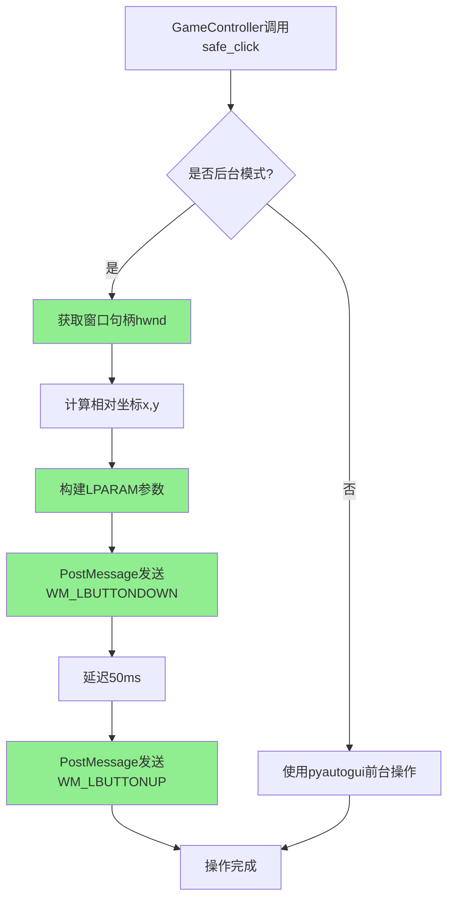
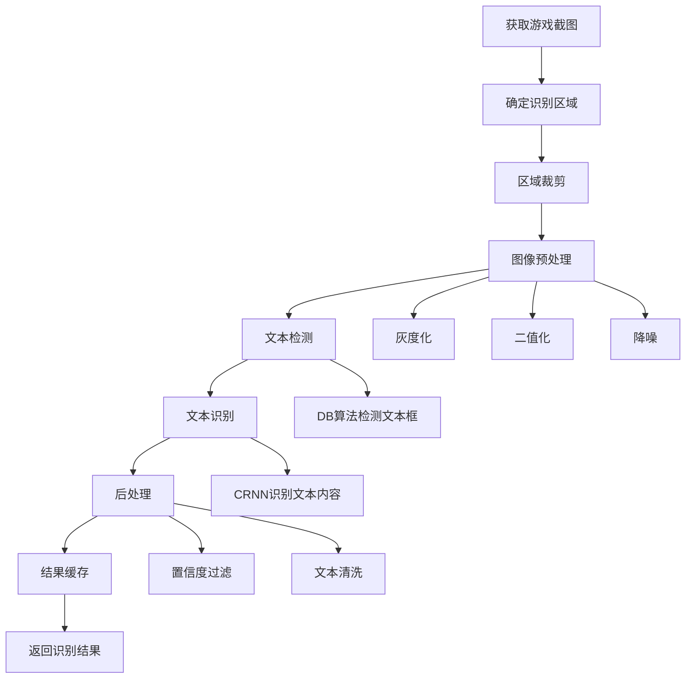
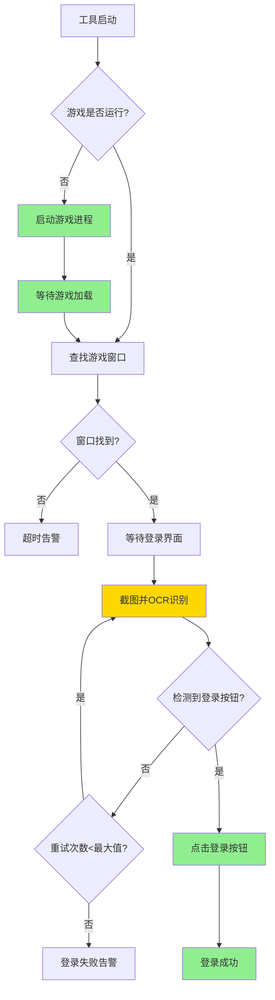
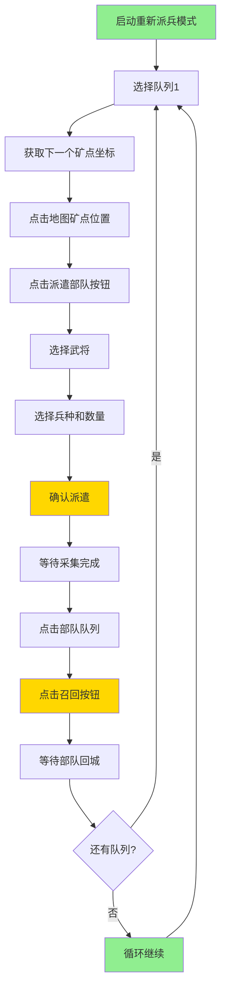
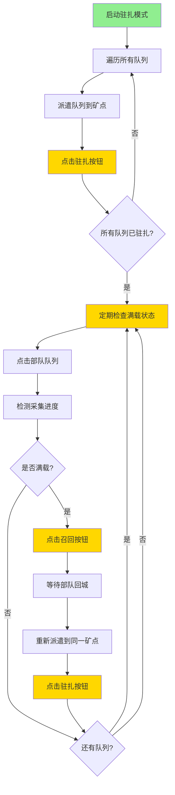

# 万国觉醒游戏辅助工具 - 详细设计文档

> **文档版本**: v5.0  
> **创建日期**: 2026-04-13  
> **更新日期**: 2026-04-17  
> **文档状态**: 设计阶段  
> **更新说明**: 增加游戏启动管理模块、自动登录功能；补充多开支持架构、OCR文字识别模块

---

## 目录

1. [架构优化分析](#1-架构优化分析)
2. [系统架构设计](#2-系统架构设计)
3. [核心类设计](#3-核心类设计)
4. [数据模型设计](#4-数据模型设计)
5. [接口设计](#5-接口设计)
6. [关键流程设计](#6-关键流程设计)
7. [配置方案设计](#7-配置方案设计)
8. [异常处理策略](#8-异常处理策略)
9. [数据库设计](#9-数据库设计)
10. [API接口定义](#10-api接口定义)
11. [错误码定义](#11-错误码定义)
12. [数据采集方案](#12-数据采集方案)
13. [安全机制设计](#13-安全机制设计)
14. [多开架构设计](#14-多开架构设计)
15. [OCR模块设计](#15-ocr模块设计)
16. [游戏启动管理模块](#16-游戏启动管理模块)
17. [测试策略](#17-测试策略)
18. [开发里程碑](#18-开发里程碑)

---

## 1. 架构优化分析

### 1.1 原有架构改进点

#### 1.1.1 四层架构优化建议

**原架构问题**:
- 业务逻辑层承担了过多职责（自动化、识别、交互、配置混合）
- 缺少事件驱动机制，模块间耦合度高
- 没有统一的错误处理和异常恢复层
- 配置管理仅作为服务存在，缺少热更新能力

**优化后的五层架构**:

```
+---------------------------------------------------------------+
|                      表现层 (Presentation)                      |
|  +----------+  +----------+  +----------+  +----------+      |
|  | 主窗口   |  | 设置面板 |  | 调试窗口 |  | 日志面板 |      |
|  +----------+  +----------+  +----------+  +----------+      |
+---------------------------------------------------------------+
|                      协调层 (Orchestration)                    |
|  +------------------+  +------------------+  +------------+  |
|  |  事件总线        |  |  任务调度器      |  | 插件管理器 |  |
|  |  (EventBus)      |  |  (TaskScheduler) |  |(PluginMgr) |  |
|  +------------------+  +------------------+  +------------+  |
+---------------------------------------------------------------+
|                      业务逻辑层 (Business)                     |
|  +----------+  +----------+  +----------+  +----------+      |
|  | 自动化   |  | 游戏     |  | 检测     |  | 配置     |      |
|  | 引擎     |  | 控制器   |  | 服务     |  | 管理器   |      |
|  +----------+  +----------+  +----------+  +----------+      |
+---------------------------------------------------------------+
|                      核心能力层 (Core)                         |
|  +----------+  +----------+  +----------+  +----------+      |
|  | 窗口     |  | YOLO     |  | 输入     |  | 图像     |      |
|  | 捕获器   |  | 检测器   |  | 控制器   |  | 处理器   |      |
|  +----------+  +----------+  +----------+  +----------+      |
+---------------------------------------------------------------+
|                      基础设施层 (Infrastructure)               |
|  +----------+  +----------+  +----------+  +----------+      |
|  | 日志     |  | 异常     |  | 缓存     |  | 工具     |      |
|  | 系统     |  | 处理     |  | 系统     |  | 函数库   |      |
|  +----------+  +----------+  +----------+  +----------+      |
+---------------------------------------------------------------+
```

**关键改进**:
1. **新增协调层**: 解耦业务逻辑与表现层，引入事件总线、任务调度器和插件管理器
2. **事件驱动**: 所有模块通过事件总线通信，降低耦合度
3. **插件化**: 每个自动化功能作为独立插件，支持动态加载/卸载
4. **策略模式**: 不同游戏行为使用不同策略类（采集策略、升级策略、训练策略）

#### 1.1.2 模块职责划分

| 模块 | 职责 | 不应承担的职责 |
|------|------|----------------|
| WindowCapture | 窗口查找、截图、分辨率管理 | 图像处理、检测逻辑 |
| YOLODetector | 模型加载、推理、结果解析 | 业务逻辑、UI交互 |
| AutomationEngine | 任务编排、状态管理 | 具体操作实现、检测 |
| GameController | 鼠标/键盘模拟、安全控制 | 检测逻辑、业务决策 |
| TaskScheduler | 任务调度、定时触发 | 任务执行逻辑 |
| ConfigManager | 配置读写、验证、热更新 | 业务逻辑 |
| EventBus | 事件发布/订阅 | 业务逻辑、数据处理 |
| PluginManager | 插件生命周期管理 | 插件内部逻辑 |

#### 1.1.3 中间件与抽象层

需要新增以下抽象层:

```python
# 1. 检测器抽象基类
class BaseDetector(ABC):
    """检测器抽象基类，支持未来扩展其他检测方式"""
    @abstractmethod
    def detect(self, image: np.ndarray) -> DetectionResult:
        pass

# 2. 输入控制器抽象基类
class BaseInputController(ABC):
    """输入控制抽象基类，支持切换不同输入库"""
    @abstractmethod
    def click(self, x: int, y: int, button: str = "left"):
        pass

# 3. 任务策略抽象基类
class BaseTaskStrategy(ABC):
    """任务策略基类，不同游戏行为实现不同策略"""
    @abstractmethod
    def execute(self, context: TaskContext) -> TaskResult:
        pass

# 4. 插件接口
class IPlugin(ABC):
    """插件接口，所有功能插件必须实现"""
    @abstractmethod
    def initialize(self):
        pass
    @abstractmethod
    def shutdown(self):
        pass
```

#### 1.1.4 错误处理与异常恢复机制

设计三层异常处理:

```
+------------------+
|  应用层异常处理   |  -> 用户可恢复的错误（窗口丢失、配置错误）
+------------------+
|  业务层异常处理   |  -> 可重试的错误（检测失败、操作超时）
+------------------+
|  核心层异常处理   |  -> 不可恢复的错误（模型加载失败、系统异常）
+------------------+
```

**恢复策略**:
- **自动重试**: 检测失败/操作超时 -> 指数退避重试（最多3次）
- **状态快照**: 关键操作前保存状态 -> 异常后回滚
- **安全暂停**: 连续失败 -> 暂停所有任务并通知用户
- **崩溃恢复**: 程序异常退出 -> 重启后恢复上次状态

#### 1.1.5 配置热更新能力

```
配置文件变更 -> 文件监听器检测 -> 配置验证 -> 发送变更事件 -> 模块更新配置
```

- 使用 `watchdog` 库监听配置文件变化
- 配置变更后先验证格式和有效性
- 验证通过后通过 EventBus 发送 `ConfigChangedEvent`
- 各模块订阅事件并更新内部状态

### 1.2 技术选型优化评估

#### 1.2.1 现有技术栈合理性

| 技术 | 合理性 | 评估 |
|------|--------|------|
| PyQt6 | 高 | 成熟稳定，跨平台，丰富的UI组件 |
| YOLOv8n | 高 | 轻量快速，满足实时检测需求 |
| PyAutoGUI | 中高 | 简单易用，但性能一般，后续可优化 |
| pywin32 | 高 | Windows原生API，窗口操作必须 |
| PyYAML | 高 | 配置文件标准选择 |
| threading | 中 | Python GIL限制，可考虑asyncio |

#### 1.2.2 性能与稳定性权衡

| 指标 | 目标值 | 实现策略 |
|------|--------|----------|
| 检测延迟 | ≤100ms | YOLOv8n + 640x640输入 + GPU推理(可选) |
| 内存占用 | ≤500MB | 模型懒加载 + 图像缓冲池 + 定期GC |
| CPU占用 | ≤30% | 检测帧率控制（非每帧检测）+ 线程池 |
| 点击延迟 | ≤200ms | 预计算坐标 + 直接调用API |

### 1.3 扩展性设计

#### 1.3.1 插件化架构

```
plugins/
├── __init__.py
├── base_plugin.py          # 插件基类
├── gem_collect/            # 宝石采集插件
│   ├── __init__.py
│   ├── gem_collect_plugin.py
│   └── gem_strategy.py
├── resource_collect/       # 资源收集插件
├── building_upgrade/       # 建筑升级插件
└── army_training/          # 军队训练插件
```

**插件生命周期**:
```
发现 -> 加载 -> 初始化 -> 注册 -> 运行 -> 暂停/恢复 -> 卸载
```

#### 1.3.2 模型版本管理策略

```
models/
├── v1.0/
│   ├── rok_detector.pt
│   └── classes.json
├── v1.1/
│   ├── rok_detector.pt
│   └── classes.json
└── current -> v1.0  (符号链接)
```

- 模型文件带版本号目录管理
- `current` 符号链接指向当前使用版本
- 配置文件中指定模型版本路径
- 支持运行时切换模型版本（需重新加载）

### 1.4 安全性与稳定性

#### 1.4.1 反作弊应对策略

| 策略 | 实现方式 |
|------|----------|
| 随机延迟 | 每次操作添加 50-300ms 随机延迟 |
| 随机偏移 | 点击位置添加 ±5px 随机偏移 |
| 操作间隔 | 两次操作间保持 1-3s 间隔 |
| 行为随机化 | 偶尔跳过非关键操作，模拟人类行为 |
| 时段限制 | 可配置运行时间段，避免深夜异常 |

#### 1.4.2 崩溃恢复机制

```python
# 状态持久化
class StateManager:
    """运行状态管理器"""
    def save_state(self, state: dict):
        """保存当前状态到文件"""
        pass

    def load_state(self) -> dict:
        """程序启动时恢复状态"""
        pass

    def clear_state(self):
        """正常退出时清除状态"""
        pass
```

---

## 2. 系统架构设计

### 2.1 优化后架构图

```
+-----------------------------------------------------------------------+
|                          PyQt6 GUI (表现层)                             |
|  +-------------+  +-------------+  +-------------+  +-------------+   |
|  | MainWindow  |  | SettingsDlg |  | DebugWindow |  | LogPanel    |   |
|  +-------------+  +-------------+  +-------------+  +-------------+   |
|         |               |               |               |              |
+---------+---------------+---------------+---------------+--------------+
|                          协调层                                            |
|  +------------------+    +------------------+    +------------------+    |
|  |    EventBus      |<-->|  TaskScheduler   |<-->|  PluginManager   |    |
|  |  (事件发布/订阅)  |    |  (定时/条件触发)  |    |  (插件生命周期)   |    |
|  +------------------+    +------------------+    +------------------+    |
|         |                       |                       |               |
+---------+-----------------------+-----------------------+---------------+
|                          业务逻辑层                                        |
|  +-------------+  +-------------+  +-------------+  +-------------+      |
|  |Automation   |  | Game        |  | Detection   |  | Config      |      |
|  |Engine       |  | Controller  |  | Service     |  | Manager     |      |
|  +-------------+  +-------------+  +-------------+  +-------------+      |
|         |               |               |               |                |
+---------+---------------+---------------+---------------+----------------+
|                          核心能力层                                        |
|  +-------------+  +-------------+  +-------------+  +-------------+      |
|  | Window      |  | YOLO        |  | Input       |  | Image       |      |
|  | Capture     |  | Detector    |  | Controller  |  | Processor   |      |
|  +-------------+  +-------------+  +-------------+  +-------------+      |
|         |               |               |               |                |
+---------+---------------+---------------+---------------+----------------+
|                          基础设施层                                        |
|  +-------------+  +-------------+  +-------------+  +-------------+      |
|  | Logger      |  | Exception   |  | Cache       |  | Utils       |      |
|  | System      |  | Handler     |  | System      |  | Library     |      |
|  +-------------+  +-------------+  +-------------+  +-------------+      |
+-----------------------------------------------------------------------+
```

### 2.2 模块职责说明

| 模块 | 职责 | 依赖 | 被依赖 |
|------|------|------|--------|
| EventBus | 事件发布订阅、模块解耦 | 无 | 所有模块 |
| TaskScheduler | 任务调度、定时触发、优先级管理 | EventBus | AutomationEngine |
| PluginManager | 插件发现、加载、注册、卸载 | EventBus | 各插件 |
| AutomationEngine | 任务编排、状态机管理、执行流程 | GameController, DetectionService | TaskScheduler, Plugins |
| GameController | 鼠标/键盘模拟、安全控制、坐标转换 | WindowCapture, BackgroundInputController | AutomationEngine |
| DetectionService | 检测请求处理、结果缓存、模型管理 | YOLODetector, WindowCapture | AutomationEngine |
| YOLODetector | 模型加载、推理、结果解析 | PyTorch, Ultralytics | DetectionService |
| WindowCapture | 窗口查找、截图、分辨率管理 | pywin32 | 多个模块 |
| BackgroundInputController | 后台输入控制、PostMessage消息发送 | pywin32 | GameController |
| ConfigManager | 配置读写、验证、热更新 | PyYAML, watchdog | 所有模块 |
| Logger | 日志记录、文件轮转、级别控制 | logging | 所有模块 |

### 2.3 项目目录结构

```
rok_assistant/
├── main.py                         # 程序入口
├── config.yaml                     # 配置文件
├── requirements.txt                # 依赖列表
│
├── core/                           # 核心能力层
│   ├── __init__.py
│   ├── window_capture.py           # 窗口捕获
│   ├── yolo_detector.py            # YOLO检测器
│   ├── input_controller.py         # 输入控制器
│   └── image_processor.py          # 图像处理器
│
├── business/                       # 业务逻辑层
│   ├── __init__.py
│   ├── automation_engine.py        # 自动化引擎
│   ├── game_controller.py          # 游戏交互控制
│   ├── detection_service.py        # 检测服务
│   └── config_manager.py           # 配置管理器
│
├── coordination/                   # 协调层
│   ├── __init__.py
│   ├── event_bus.py                # 事件总线
│   ├── task_scheduler.py           # 任务调度器
│   └── plugin_manager.py           # 插件管理器
│
├── plugins/                        # 插件目录
│   ├── __init__.py
│   ├── base_plugin.py              # 插件基类
│   ├── gem_collect/                # 宝石采集插件
│   │   ├── __init__.py
│   │   ├── plugin.py
│   │   └── strategy.py
│   └── ...
│
├── gui/                            # 表现层
│   ├── __init__.py
│   ├── main_window.py              # 主窗口
│   ├── settings_dialog.py          # 设置面板
│   ├── debug_window.py             # 调试窗口
│   ├── log_panel.py                # 日志面板
│   └── widgets/                    # 自定义控件
│       ├── __init__.py
│       └── ...
│
├── models/                         # 数据模型
│   ├── __init__.py
│   ├── task.py                     # 任务模型
│   ├── detection.py                # 检测结果模型
│   ├── game_element.py             # 游戏元素模型
│   └── config.py                   # 配置模型
│
├── infrastructure/                 # 基础设施层
│   ├── __init__.py
│   ├── logger.py                   # 日志系统
│   ├── exception_handler.py        # 异常处理
│   ├── cache.py                    # 缓存系统
│   └── state_manager.py            # 状态管理
│
├── tests/                          # 测试目录
│   ├── unit/
│   ├── integration/
│   └── performance/
│
└── resources/                      # 资源文件
    ├── icons/
    ├── models/
    └── styles/
```

---

## 3. 核心类设计

### 3.1 WindowCapture（窗口捕获）

#### 类图

```
┌─────────────────────────────────────────────────┐
│                  WindowCapture                   │
├─────────────────────────────────────────────────┤
│ - _hwnd: Optional[int]                          │
│ - _window_title: str                            │
│ - _rect: Optional[Tuple[int,int,int,int]]       │
│ - _client_rect: Optional[Tuple[int,int,int,int]]│
│ - _dpi_scale: float                             │
│ - _logger: Logger                               │
├─────────────────────────────────────────────────┤
│ + __init__(window_title: str)                   │
│ + find_window() -> bool                         │
│ + get_client_rect() -> Tuple[int,int,int,int]   │
│ + capture() -> Optional[np.ndarray]             │
│ + capture_background() -> Optional[np.ndarray]  │
│ + capture_region(x,y,w,h) -> np.ndarray         │
│ + is_window_active() -> bool                    │
│ + bring_to_foreground() -> bool                 │
│ + get_window_size() -> Tuple[int, int]          │
│ + close() -> None                               │
│ + window_title: property                        │
│ + hwnd: property                                │
└─────────────────────────────────────────────────┘
```

#### 详细设计

```python
class WindowCapture:
    """游戏窗口捕获模块

    职责:
    - 查找并定位游戏窗口
    - 截取窗口画面（支持区域截取）
    - 处理DPI缩放
    - 管理窗口状态

    线程安全: 是（内部使用锁保护）
    异常: WindowNotFoundError, CaptureError
    """

    def __init__(self, window_title: str, dpi_aware: bool = True):
        """
        Args:
            window_title: 窗口标题关键词（模糊匹配）
            dpi_aware: 是否启用DPI感知
        """
        self._window_title = window_title
        self._hwnd: Optional[int] = None
        self._rect: Optional[Tuple[int, int, int, int]] = None
        self._client_rect: Optional[Tuple[int, int, int, int]] = None
        self._dpi_scale: float = 1.0
        self._lock = threading.Lock()
        self._logger = get_logger(self.__class__.__name__)

        if dpi_aware:
            self._setup_dpi_awareness()

    def find_window(self) -> bool:
        """
        查找游戏窗口（支持模糊匹配标题）

        Returns:
            bool: 是否找到窗口

        Raises:
            WindowNotFoundError: 未找到匹配窗口
        """
        def callback(hwnd, results):
            if win32gui.IsWindowVisible(hwnd):
                title = win32gui.GetWindowText(hwnd)
                if self._window_title.lower() in title.lower():
                    results.append(hwnd)
            return True

        results = []
        win32gui.EnumWindows(callback, results)

        if not results:
            self._logger.error(f"Window not found: {self._window_title}")
            return False

        self._hwnd = results[0]
        self._rect = win32gui.GetWindowRect(self._hwnd)
        left, top, right, bottom = win32gui.GetClientRect(self._hwnd)
        self._client_rect = (0, 0, right - left, bottom - top)
        self._logger.info(f"Window found: hwnd={self._hwnd}, size={self._client_rect[2:]}")
        return True

    def capture(self) -> Optional[np.ndarray]:
        """
        截取窗口客户区画面

        Returns:
            np.ndarray: BGR格式图像，失败返回None
        """
        with self._lock:
            if not self._hwnd or not win32gui.IsWindow(self._hwnd):
                self._logger.error("Invalid window handle")
                return None

            try:
                left, top, right, bottom = self._client_rect
                width = int((right - left) * self._dpi_scale)
                height = int((bottom - top) * self._dpi_scale)

                # 使用pywin32 BitBlt进行截图
                hwnd_dc = win32gui.GetWindowDC(self._hwnd)
                mfc_dc = win32ui.CreateDCFromHandle(hwnd_dc)
                save_dc = mfc_dc.CreateCompatibleDC()

                bitmap = win32ui.CreateBitmap()
                bitmap.CreateCompatibleBitmap(mfc_dc, width, height)
                save_dc.SelectObject(bitmap)

                # 截图
                save_dc.BitBlt((0, 0), (width, height), mfc_dc,
                              (int(left * self._dpi_scale), int(top * self._dpi_scale)),
                              win32con.SRCCOPY)

                # 转换为numpy数组
                bmpinfo = bitmap.GetInfo()
                bmpstr = bitmap.GetBitmapBits(True)
                img = np.frombuffer(bmpstr, dtype=np.uint8).reshape(
                    (bmpinfo['bmHeight'], bmpinfo['bmWidth'], 4)
                )
                img = cv2.cvtColor(img, cv2.COLOR_BGRA2BGR)

                # 清理资源
                win32gui.DeleteObject(bitmap.GetHandle())
                save_dc.DeleteDC()
                mfc_dc.DeleteDC()
                win32gui.ReleaseDC(self._hwnd, hwnd_dc)

                return img

            except Exception as e:
                self._logger.error(f"Capture failed: {e}")
                return None

    def capture_region(self, x: int, y: int, w: int, h: int) -> Optional[np.ndarray]:
        """截取窗口指定区域"""
        pass

    def capture_background(self) -> Optional[np.ndarray]:
        """
        后台截取窗口画面（使用PrintWindow API）
        
        特点：
        - 窗口无需在前台
        - 支持最小化状态截图
        - 使用PrintWindow API而非BitBlt
        
        Returns:
            np.ndarray: BGR格式图像，失败返回None
        """
        with self._lock:
            if not self._hwnd or not win32gui.IsWindow(self._hwnd):
                self._logger.error("Invalid window handle")
                return None

            try:
                left, top, right, bottom = self._client_rect
                width = int((right - left) * self._dpi_scale)
                height = int((bottom - top) * self._dpi_scale)

                # 使用PrintWindow进行后台截图
                hwnd_dc = win32gui.GetWindowDC(self._hwnd)
                mfc_dc = win32ui.CreateDCFromHandle(hwnd_dc)
                save_dc = mfc_dc.CreateCompatibleDC()

                bitmap = win32ui.CreateBitmap()
                bitmap.CreateCompatibleBitmap(mfc_dc, width, height)
                save_dc.SelectObject(bitmap)

                # PrintWindow API (PW_RENDERFULLCONTENT = 0x00000002)
                windll.user32.PrintWindow(self._hwnd, save_dc.GetSafeHdc(), 2)

                # 转换为numpy数组
                bmpinfo = bitmap.GetInfo()
                bmpstr = bitmap.GetBitmapBits(True)
                img = np.frombuffer(bmpstr, dtype=np.uint8).reshape(
                    (bmpinfo['bmHeight'], bmpinfo['bmWidth'], 4)
                )
                img = cv2.cvtColor(img, cv2.COLOR_BGRA2BGR)

                # 清理资源
                win32gui.DeleteObject(bitmap.GetHandle())
                save_dc.DeleteDC()
                mfc_dc.DeleteDC()
                win32gui.ReleaseDC(self._hwnd, hwnd_dc)

                self._logger.debug(f"Background capture success: {width}x{height}")
                return img

            except Exception as e:
                self._logger.error(f"Background capture failed: {e}")
                return None

    def is_window_active(self) -> bool:
        """检查窗口是否在前台"""
        return self._hwnd is not None and win32gui.GetForegroundWindow() == self._hwnd

    def bring_to_foreground(self) -> bool:
        """将窗口带到前台"""
        if self._hwnd:
            win32gui.SetForegroundWindow(self._hwnd)
            return True
        return False
```

### 3.2 YOLODetector（目标检测）

#### 类图

```
┌─────────────────────────────────────────────────┐
│              +<<abstract>>+                      │
│              BaseDetector                        │
├─────────────────────────────────────────────────┤
│ + detect(image: ndarray) -> DetectionResult      │
│ + load_model(path: str) -> bool                  │
│ + unload_model() -> None                         │
└─────────────────────────────────────────────────┘
                      ▲
                      │ implements
┌─────────────────────────────────────────────────┐
│                  YOLODetector                    │
├─────────────────────────────────────────────────┤
│ - _model: Optional[YOLO]                        │
│ - _model_path: str                              │
│ - _confidence_threshold: float                  │
│ - _iou_threshold: float                         │
│ - _input_size: int                              │
│ - _class_names: List[str]                       │
│ - _device: str                                  │
│ - _logger: Logger                               │
├─────────────────────────────────────────────────┤
│ + __init__(model_path, conf, iou, input_size)   │
│ + detect(image: ndarray) -> DetectionResult     │
│ + detect_elements(class_names: List[str])       │
│ + get_element_positions(class_name: str)        │
│ + load_model() -> bool                          │
│ + unload_model() -> None                        │
│ + switch_model(new_path: str) -> bool           │
│ + is_loaded: property -> bool                   │
│ + class_names: property -> List[str]            │
└─────────────────────────────────────────────────┘
```

#### 详细设计

```python
class YOLODetector(BaseDetector):
    """YOLO目标检测模块

    职责:
    - 加载/卸载YOLO模型
    - 执行目标检测推理
    - 解析检测结果
    - 支持模型热切换

    线程安全: 推理线程安全（YOLO内部处理）
    异常: ModelLoadError, InferenceError
    """

    def __init__(
        self,
        model_path: str,
        confidence_threshold: float = 0.5,
        iou_threshold: float = 0.45,
        input_size: int = 640,
        device: str = "cpu",
    ):
        self._model_path = model_path
        self._confidence_threshold = confidence_threshold
        self._iou_threshold = iou_threshold
        self._input_size = input_size
        self._device = device
        self._model: Optional[YOLO] = None
        self._class_names: List[str] = []
        self._logger = get_logger(self.__class__.__name__)

    def load_model(self) -> bool:
        """
        加载YOLO模型

        Returns:
            bool: 加载是否成功
        """
        try:
            self._model = YOLO(self._model_path)
            self._class_names = list(self._model.names.values())
            self._logger.info(
                f"Model loaded: {self._model_path}, "
                f"classes: {len(self._class_names)}, device: {self._device}"
            )
            return True
        except Exception as e:
            self._logger.error(f"Failed to load model: {e}")
            return False

    def detect(self, image: np.ndarray) -> DetectionResult:
        """
        执行目标检测

        Args:
            image: BGR格式输入图像

        Returns:
            DetectionResult: 检测结果

        Raises:
            InferenceError: 推理失败
        """
        if self._model is None:
            raise InferenceError("Model not loaded")

        try:
            results = self._model(
                image,
                conf=self._confidence_threshold,
                iou=self._iou_threshold,
                imgsz=self._input_size,
                device=self._device,
                verbose=False,
            )

            return self._parse_results(results[0], image.shape)

        except Exception as e:
            raise InferenceError(f"Inference failed: {e}") from e

    def _parse_results(self, result, original_shape: tuple) -> DetectionResult:
        """解析YOLO检测结果"""
        elements = []
        boxes = result.boxes

        if boxes is not None:
            for i in range(len(boxes)):
                x1, y1, x2, y2 = boxes.xyxy[i].cpu().numpy()
                conf = float(boxes.conf[i].cpu().numpy())
                cls_id = int(boxes.cls[i].cpu().numpy())
                cls_name = self._model.names[cls_id]

                # 坐标缩放回原始图像
                scale_x = original_shape[1] / self._input_size
                scale_y = original_shape[0] / self._input_size

                elements.append(DetectionElement(
                    class_name=cls_name,
                    class_id=cls_id,
                    confidence=conf,
                    bbox=BoundingBox(
                        x1=int(x1 * scale_x),
                        y1=int(y1 * scale_y),
                        x2=int(x2 * scale_x),
                        y2=int(y2 * scale_y),
                    ),
                    center=(
                        int((x1 + x2) / 2 * scale_x),
                        int((y1 + y2) / 2 * scale_y),
                    ),
                ))

        return DetectionResult(
            elements=elements,
            image_width=original_shape[1],
            image_height=original_shape[0],
            timestamp=time.time(),
        )

    def switch_model(self, new_model_path: str) -> bool:
        """
        运行时切换模型

        Args:
            new_model_path: 新模型路径

        Returns:
            bool: 切换是否成功
        """
        self.unload_model()
        self._model_path = new_model_path
        return self.load_model()
```

### 3.3 AutomationEngine（自动化引擎）

#### 类图

```
┌─────────────────────────────────────────────────┐
│               AutomationEngine                   │
├─────────────────────────────────────────────────┤
│ - _state: EngineState                           │
│ - _game_controller: GameController              │
│ - _detection_service: DetectionService          │
│ - _event_bus: EventBus                          │
│ - _current_task: Optional[AutomationTask]       │
│ - _task_history: List[TaskResult]               │
│ - _state_machine: StateMachine                  │
│ - _logger: Logger                               │
├─────────────────────────────────────────────────┤
│ + __init__(controller, detection, event_bus)    │
│ + start() -> None                               │
│ + stop() -> None                                │
│ + pause() -> None                               │
│ + resume() -> None                              │
│ + execute_task(task: AutomationTask)            │
│ + register_strategy(name, strategy)             │
│ + get_state() -> EngineState                    │
│ + _main_loop() -> None                          │
│ + _handle_error(error) -> None                  │
│ + state: property -> EngineState                │
└─────────────────────────────────────────────────┘
```

#### 详细设计

```python
class EngineState(Enum):
    IDLE = "idle"
    RUNNING = "running"
    PAUSED = "paused"
    ERROR = "error"
    STOPPING = "stopping"


class AutomationEngine:
    """自动化任务引擎

    职责:
    - 任务编排和执行
    - 状态机管理
    - 错误处理和恢复
    - 与游戏交互服务和检测服务协调

    线程安全: 主循环运行在独立线程
    异常: EngineError, TaskExecutionError
    """

    def __init__(
        self,
        game_controller: "GameController",
        detection_service: "DetectionService",
        event_bus: "EventBus",
    ):
        self._state = EngineState.IDLE
        self._game_controller = game_controller
        self._detection_service = detection_service
        self._event_bus = event_bus
        self._current_task: Optional[AutomationTask] = None
        self._task_history: List[TaskResult] = []
        self._strategies: Dict[str, BaseTaskStrategy] = {}
        self._thread: Optional[threading.Thread] = None
        self._stop_event = threading.Event()
        self._logger = get_logger(self.__class__.__name__)

    def start(self) -> None:
        """启动自动化引擎"""
        if self._state != EngineState.IDLE:
            self._logger.warning(f"Engine not in IDLE state: {self._state}")
            return

        self._state = EngineState.RUNNING
        self._stop_event.clear()
        self._thread = threading.Thread(target=self._main_loop, daemon=True)
        self._thread.start()
        self._event_bus.publish(EngineStartedEvent())
        self._logger.info("Automation engine started")

    def stop(self) -> None:
        """停止自动化引擎"""
        self._state = EngineState.STOPPING
        self._stop_event.set()
        if self._thread:
            self._thread.join(timeout=5.0)
        self._state = EngineState.IDLE
        self._event_bus.publish(EngineStoppedEvent())
        self._logger.info("Automation engine stopped")

    def register_strategy(self, task_type: str, strategy: BaseTaskStrategy) -> None:
        """注册任务策略"""
        self._strategies[task_type] = strategy

    def _main_loop(self) -> None:
        """主循环"""
        retry_count = 0
        max_retries = 3

        while not self._stop_event.is_set():
            try:
                # 等待调度器分配任务
                task = self._event_bus.wait_for_task(timeout=1.0)
                if task is None:
                    continue

                self._current_task = task
                strategy = self._strategies.get(task.task_type)

                if strategy is None:
                    self._logger.error(f"No strategy for task type: {task.task_type}")
                    self._event_bus.publish(TaskFailedEvent(task.id, "No strategy"))
                    continue

                # 执行任务
                context = TaskContext(
                    game_controller=self._game_controller,
                    detection_service=self._detection_service,
                    config=task.config,
                )

                result = strategy.execute(context)
                self._task_history.append(result)
                retry_count = 0

                if result.success:
                    self._event_bus.publish(TaskCompletedEvent(task.id, result))
                else:
                    self._event_bus.publish(TaskFailedEvent(task.id, result.error))

            except Exception as e:
                retry_count += 1
                self._logger.error(f"Main loop error (retry {retry_count}): {e}")

                if retry_count >= max_retries:
                    self._state = EngineState.ERROR
                    self._event_bus.publish(EngineErrorEvent(str(e)))
                    break

                time.sleep(min(2 ** retry_count, 10))  # 指数退避
```

### 3.4 TaskScheduler（任务调度）

#### 类图

```
┌─────────────────────────────────────────────────┐
│                  TaskScheduler                   │
├─────────────────────────────────────────────────┤
│ - _tasks: List[ScheduledTask]                   │
│ - _event_bus: EventBus                          │
│ - _running: bool                                │
│ - _thread: Optional[Thread]                     │
│ - _lock: Lock                                   │
│ - _logger: Logger                               │
├─────────────────────────────────────────────────┤
│ + __init__(event_bus: EventBus)                 │
│ + add_task(task: ScheduledTask) -> str          │
│ + remove_task(task_id: str) -> bool             │
│ + enable_task(task_id: str) -> bool             │
│ + disable_task(task_id: str) -> bool            │
│ + start() -> None                               │
│ + stop() -> None                                │
│ + get_tasks() -> List[ScheduledTask]            │
│ + _scheduler_loop() -> None                     │
│ + _check_due_tasks() -> None                    │
└─────────────────────────────────────────────────┘
```

#### 详细设计

```python
class TriggerType(Enum):
    INTERVAL = "interval"       # 定时触发
    CONDITION = "condition"     # 条件触发
    MANUAL = "manual"           # 手动触发
    ONCE = "once"               # 一次性触发


@dataclass
class ScheduledTask:
    """调度任务"""
    id: str
    task_type: str              # 关联的策略类型
    trigger_type: TriggerType
    interval_seconds: int = 0   # 间隔触发时使用
    condition: Optional[Callable] = None  # 条件触发时使用
    priority: int = 5           # 优先级 1-10，10最高
    config: Dict[str, Any] = field(default_factory=dict)
    enabled: bool = True
    last_run: Optional[float] = None
    next_run: Optional[float] = None
    run_count: int = 0


class TaskScheduler:
    """任务调度器

    职责:
    - 管理定时/条件/手动触发任务
    - 任务优先级管理
    - 触发时机计算
    - 与事件总线通信

    线程安全: 是
    """

    def __init__(self, event_bus: "EventBus"):
        self._tasks: Dict[str, ScheduledTask] = {}
        self._event_bus = event_bus
        self._running = False
        self._thread: Optional[threading.Thread] = None
        self._lock = threading.Lock()
        self._logger = get_logger(self.__class__.__name__)

    def add_task(self, task: ScheduledTask) -> str:
        """添加调度任务"""
        with self._lock:
            now = time.time()
            if task.trigger_type == TriggerType.INTERVAL:
                task.next_run = now + task.interval_seconds
            elif task.trigger_type == TriggerType.ONCE:
                task.next_run = now
            self._tasks[task.id] = task
            self._logger.info(f"Task added: {task.id}, type={task.task_type}")
            return task.id

    def _scheduler_loop(self) -> None:
        """调度循环"""
        while self._running:
            try:
                self._check_due_tasks()
                time.sleep(0.5)  # 检查间隔
            except Exception as e:
                self._logger.error(f"Scheduler loop error: {e}")
                time.sleep(1.0)

    def _check_due_tasks(self) -> None:
        """检查并触发到期的任务"""
        now = time.time()
        with self._lock:
            due_tasks = []
            for task in self._tasks.values():
                if not task.enabled:
                    continue
                if task.trigger_type == TriggerType.MANUAL:
                    continue
                if task.next_run is not None and now >= task.next_run:
                    due_tasks.append(task)

            # 按优先级排序
            due_tasks.sort(key=lambda t: t.priority, reverse=True)

            for task in due_tasks:
                self._event_bus.publish(TaskTriggeredEvent(task))
                task.last_run = now
                task.run_count += 1

                if task.trigger_type == TriggerType.INTERVAL:
                    task.next_run = now + task.interval_seconds
                elif task.trigger_type == TriggerType.ONCE:
                    task.enabled = False
```

### 3.5 GameController（游戏交互控制）

#### 类图

```
┌─────────────────────────────────────────────────┐
│              +<<abstract>>+                      │
│              BaseInputController                 │
├─────────────────────────────────────────────────┤
│ + click(x, y, button) -> None                    │
│ + double_click(x, y) -> None                     │
│ + drag(x1, y1, x2, y2) -> None                   │
│ + key_press(key) -> None                         │
│ + key_combo(keys) -> None                        │
│ + move_mouse(x, y) -> None                       │
│ + scroll(x, y, clicks) -> None                   │
└─────────────────────────────────────────────────┘
                      ▲
                      │ implements
┌─────────────────────────────────────────────────┐
│                 GameController                   │
├─────────────────────────────────────────────────┤
│ - _window_capture: WindowCapture                │
│ - _mouse: MouseController                       │
│ - _keyboard: KeyboardController                 │
│ - _safety_config: SafetyConfig                  │
│ - _logger: Logger                               │
├─────────────────────────────────────────────────┤
│ + __init__(capture, safety_config)              │
│ + safe_click(x, y, button) -> bool              │
│ + safe_drag(x1,y1,x2,y2) -> bool                │
│ + safe_key_press(key) -> bool                   │
│ + safe_key_combo(keys) -> bool                  │
│ + click_element(element) -> bool                │
│ + navigate_to(screen_type) -> bool              │
│ + _apply_safety_delay() -> None                 │
│ + _randomize_position(x, y) -> Tuple[int, int]  │
└─────────────────────────────────────────────────┘
```

#### 详细设计

```python
@dataclass
class SafetyConfig:
    """安全操作配置"""
    min_delay: float = 0.05      # 最小操作间隔(s)
    max_delay: float = 0.3       # 最大操作间隔(s)
    random_offset: int = 5       # 随机偏移(像素)
    click_duration: float = 0.1  # 点击持续时间
    max_actions_per_minute: int = 30  # 每分钟最大操作数


class GameController:
    """游戏交互控制器

    职责:
    - 安全的鼠标/键盘操作
    - 随机延迟和偏移
    - 操作频率限制
    - 坐标转换（相对窗口坐标）

    线程安全: 是（操作串行化）
    """

    def __init__(
        self,
        window_capture: WindowCapture,
        safety_config: SafetyConfig,
    ):
        self._window_capture = window_capture
        self._safety_config = safety_config
        self._lock = threading.Lock()
        self._action_timestamps: List[float] = []
        self._logger = get_logger(self.__class__.__name__)

    def safe_click(self, x: int, y: int, button: str = "left") -> bool:
        """
        安全点击（带随机延迟和偏移）

        Args:
            x: X坐标（相对于窗口）
            y: Y坐标（相对于窗口）
            button: 鼠标按钮

        Returns:
            bool: 操作是否成功
        """
        with self._lock:
            try:
                # 检查操作频率
                self._check_rate_limit()

                # 随机偏移
                rx, ry = self._randomize_position(x, y)

                # 转换到屏幕绝对坐标
                screen_x, screen_y = self._to_screen_coords(rx, ry)

                # 移动鼠标
                pyautogui.moveTo(screen_x, screen_y, duration=0.1)

                # 随机延迟
                self._apply_safety_delay()

                # 执行点击
                pyautogui.click(screen_x, screen_y, button=button)

                self._logger.debug(f"Click: ({x},{y}) -> screen({screen_x},{screen_y})")
                return True

            except Exception as e:
                self._logger.error(f"Click failed: {e}")
                return False

    def _randomize_position(self, x: int, y: int) -> Tuple[int, int]:
        """添加随机偏移"""
        offset_x = random.randint(-self._safety_config.random_offset,
                                  self._safety_config.random_offset)
        offset_y = random.randint(-self._safety_config.random_offset,
                                  self._safety_config.random_offset)
        return x + offset_x, y + offset_y

    def _apply_safety_delay(self) -> None:
        """应用随机安全延迟"""
        delay = random.uniform(
            self._safety_config.min_delay,
            self._safety_config.max_delay,
        )
        time.sleep(delay)

    def _check_rate_limit(self) -> None:
        """检查操作频率限制"""
        now = time.time()
        # 清理60秒前的记录
        self._action_timestamps = [
            t for t in self._action_timestamps if now - t < 60
        ]
        if len(self._action_timestamps) >= self._safety_config.max_actions_per_minute:
            raise RateLimitError("Action rate limit exceeded")
        self._action_timestamps.append(now)
```

### 3.6 BackgroundInputController（后台输入控制）

#### 类图

```
┌─────────────────────────────────────────────────┐
│           BackgroundInputController              │
├─────────────────────────────────────────────────┤
│ - _hwnd: int                                    │
│ - _logger: Logger                               │
├─────────────────────────────────────────────────┤
│ + __init__(hwnd: int)                           │
│ + click(x, y, button) -> bool                   │
│ + double_click(x, y) -> bool                    │
│ + move_mouse(x, y) -> bool                      │
│ + drag(x1, y1, x2, y2) -> bool                  │
│ + send_key_press(vk_code) -> bool               │
│ + send_key_down(vk_code) -> bool                │
│ + send_key_up(vk_code) -> bool                  │
│ + send_text(text) -> bool                       │
│ + send_enter() -> bool                          │
│ + send_escape() -> bool                         │
└─────────────────────────────────────────────────┘
```

#### 详细设计

```python
class BackgroundInputController:
    """后台输入控制器

    职责:
    - 使用Windows API发送后台消息
    - 窗口无需前置即可操作
    - 支持最小化状态操作
    - 不干扰用户正常使用电脑

    技术原理:
    - 使用PostMessage发送WM_LBUTTONDOWN/UP等消息
    - 使用WM_KEYDOWN/UP发送键盘消息
    - 使用WM_CHAR发送字符消息
    - LPARAM编码坐标信息

    线程安全: 是（PostMessage线程安全）
    限制:
    - 某些游戏可能不响应后台消息
    - 需要窗口句柄有效
    - 不支持全局快捷键
    """

    def __init__(self, hwnd: int):
        """
        Args:
            hwnd: 窗口句柄
        """
        self._hwnd = hwnd
        self._logger = get_logger(self.__class__.__name__)

    def click(self, x: int, y: int, button: str = "left") -> bool:
        """
        后台鼠标点击

        Args:
            x: X坐标（相对于窗口客户区）
            y: Y坐标（相对于窗口客户区）
            button: 鼠标按钮 (left/right)

        Returns:
            bool: 操作是否成功
        """
        try:
            lparam = (y << 16) | (x & 0xFFFF)
            
            if button == "left":
                win32api.PostMessage(self._hwnd, win32con.WM_LBUTTONDOWN, win32con.MK_LBUTTON, lparam)
                time.sleep(0.05)
                win32api.PostMessage(self._hwnd, win32con.WM_LBUTTONUP, 0, lparam)
            elif button == "right":
                win32api.PostMessage(self._hwnd, win32con.WM_RBUTTONDOWN, win32con.MK_RBUTTON, lparam)
                time.sleep(0.05)
                win32api.PostMessage(self._hwnd, win32con.WM_RBUTTONUP, 0, lparam)
            
            self._logger.debug(f"Background click {button} at ({x}, {y})")
            return True
        except Exception as e:
            self._logger.error(f"Background click failed: {e}")
            return False

    def double_click(self, x: int, y: int) -> bool:
        """
        后台鼠标双击

        Args:
            x: X坐标
            y: Y坐标

        Returns:
            bool: 操作是否成功
        """
        try:
            lparam = (y << 16) | (x & 0xFFFF)
            win32api.PostMessage(self._hwnd, win32con.WM_LBUTTONDBLCLK, win32con.MK_LBUTTON, lparam)
            return True
        except Exception as e:
            self._logger.error(f"Background double click failed: {e}")
            return False

    def move_mouse(self, x: int, y: int) -> bool:
        """
        后台移动鼠标

        Args:
            x: X坐标
            y: Y坐标

        Returns:
            bool: 操作是否成功
        """
        try:
            lparam = (y << 16) | (x & 0xFFFF)
            win32api.PostMessage(self._hwnd, win32con.WM_MOUSEMOVE, 0, lparam)
            return True
        except Exception as e:
            self._logger.error(f"Background mouse move failed: {e}")
            return False

    def drag(self, x1: int, y1: int, x2: int, y2: int) -> bool:
        """
        后台鼠标拖拽

        Args:
            x1: 起始X坐标
            y1: 起始Y坐标
            x2: 目标X坐标
            y2: 目标Y坐标

        Returns:
            bool: 操作是否成功
        """
        try:
            lparam1 = (y1 << 16) | (x1 & 0xFFFF)
            win32api.PostMessage(self._hwnd, win32con.WM_LBUTTONDOWN, win32con.MK_LBUTTON, lparam1)
            time.sleep(0.1)
            
            lparam2 = (y2 << 16) | (x2 & 0xFFFF)
            win32api.PostMessage(self._hwnd, win32con.WM_MOUSEMOVE, win32con.MK_LBUTTON, lparam2)
            time.sleep(0.1)
            
            win32api.PostMessage(self._hwnd, win32con.WM_LBUTTONUP, 0, lparam2)
            
            self._logger.debug(f"Background drag from ({x1}, {y1}) to ({x2}, {y2})")
            return True
        except Exception as e:
            self._logger.error(f"Background drag failed: {e}")
            return False

    def send_key_press(self, vk_code: int) -> bool:
        """
        发送完整按键（按下+释放）

        Args:
            vk_code: 虚拟键码

        Returns:
            bool: 操作是否成功
        """
        try:
            win32api.PostMessage(self._hwnd, win32con.WM_KEYDOWN, vk_code, 0)
            time.sleep(0.05)
            win32api.PostMessage(self._hwnd, win32con.WM_KEYUP, vk_code, 0)
            return True
        except Exception as e:
            self._logger.error(f"Background key press failed: {e}")
            return False

    def send_key_down(self, vk_code: int) -> bool:
        """发送按键按下"""
        try:
            win32api.PostMessage(self._hwnd, win32con.WM_KEYDOWN, vk_code, 0)
            return True
        except Exception as e:
            self._logger.error(f"Background key down failed: {e}")
            return False

    def send_key_up(self, vk_code: int) -> bool:
        """发送按键释放"""
        try:
            win32api.PostMessage(self._hwnd, win32con.WM_KEYUP, vk_code, 0)
            return True
        except Exception as e:
            self._logger.error(f"Background key up failed: {e}")
            return False

    def send_text(self, text: str) -> bool:
        """
        发送文本

        Args:
            text: 要发送的文本

        Returns:
            bool: 操作是否成功
        """
        try:
            for char in text:
                code_point = ord(char)
                win32api.PostMessage(self._hwnd, win32con.WM_CHAR, code_point, 0)
                time.sleep(0.05)
            self._logger.info(f"Background sent text: {text}")
            return True
        except Exception as e:
            self._logger.error(f"Background send text failed: {e}")
            return False

    def send_enter(self) -> bool:
        """发送回车键"""
        return self.send_key_press(0x0D)

    def send_escape(self) -> bool:
        """发送ESC键"""
        return self.send_key_press(0x1B)

    def send_tab(self) -> bool:
        """发送TAB键"""
        return self.send_key_press(0x09)

    def send_space(self) -> bool:
        """发送空格键"""
        return self.send_key_press(0x20)
```

#### 后台操作流程图



#### 前台vs后台操作对比

| 特性 | 前台操作（pyautogui） | 后台操作（PostMessage） |
|------|----------------------|------------------------|
| 窗口状态要求 | 必须在前台 | 可在后台/最小化 |
| 用户干扰 | 会干扰用户操作 | 不干扰用户 |
| 多开支持 | 不支持 | 支持 |
| 坐标系统 | 屏幕绝对坐标 | 窗口相对坐标 |
| 兼容性 | 所有应用 | 部分应用可能不响应 |
| 性能 | 较低（需要移动鼠标） | 较高（直接发消息） |
| 安全性 | 可能被检测 | 较难被检测 |

### 3.7 ConfigManager（配置管理）

#### 类图

```
┌─────────────────────────────────────────────────┐
│                  ConfigManager                   │
├─────────────────────────────────────────────────┤
│ - _config: AppConfig                            │
│ - _config_path: str                             │
│ - _watcher: Optional[Observer]                  │
│ - _event_bus: EventBus                          │
│ - _lock: Lock                                   │
│ - _logger: Logger                               │
├─────────────────────────────────────────────────┤
│ + __init__(config_path, event_bus)              │
│ + load() -> AppConfig                           │
│ + save(config: AppConfig) -> bool               │
│ + get(section: str) -> Any                      │
│ + set(section: str, key: str, value: Any)       │
│ + start_watching() -> None                      │
│ + stop_watching() -> None                       │
│ + validate(config: dict) -> List[str]           │
│ + _on_config_changed(event) -> None             │
└─────────────────────────────────────────────────┘
```

#### 详细设计

```python
class ConfigManager:
    """配置管理器

    职责:
    - 配置文件读写
    - 配置验证
    - 热更新（文件监听）
    - 默认值管理

    线程安全: 是
    """

    def __init__(self, config_path: str, event_bus: "EventBus"):
        self._config_path = config_path
        self._event_bus = event_bus
        self._config: Optional[AppConfig] = None
        self._watcher: Optional[Observer] = None
        self._lock = threading.Lock()
        self._logger = get_logger(self.__class__.__name__)

    def load(self) -> AppConfig:
        """加载配置文件"""
        with self._lock:
            if not os.path.exists(self._config_path):
                self._logger.warning(f"Config not found, using defaults: {self._config_path}")
                self._config = AppConfig.get_defaults()
                self.save(self._config)
                return self._config

            try:
                with open(self._config_path, "r", encoding="utf-8") as f:
                    raw_config = yaml.safe_load(f)

                # 验证配置
                errors = self.validate(raw_config)
                if errors:
                    self._logger.error(f"Config validation errors: {errors}")
                    raise ConfigValidationError(errors)

                self._config = AppConfig.from_dict(raw_config)
                self._logger.info(f"Config loaded: {self._config_path}")
                return self._config

            except yaml.YAMLError as e:
                self._logger.error(f"YAML parse error: {e}")
                raise

    def start_watching(self) -> None:
        """启动配置热更新监听"""
        from watchdog.observers import Observer
        from watchdog.events import FileSystemEventHandler

        class ConfigChangeHandler(FileSystemEventHandler):
            def __init__(self, callback):
                self._callback = callback

            def on_modified(self, event):
                if not event.is_directory:
                    self._callback(event)

        self._watcher = Observer()
        handler = ConfigChangeHandler(self._on_config_changed)
        watch_dir = os.path.dirname(self._config_path) or "."
        self._watcher.schedule(handler, recursive=False, path=watch_dir)
        self._watcher.start()
        self._logger.info(f"Config watching started: {watch_dir}")

    def _on_config_changed(self, event) -> None:
        """配置变更回调"""
        time.sleep(0.5)  # 等待文件写入完成
        try:
            new_config = self.load()
            self._event_bus.publish(ConfigChangedEvent(new_config))
            self._logger.info("Configuration reloaded")
        except Exception as e:
            self._logger.error(f"Config reload failed: {e}")
```

### 3.7 Logger（日志系统）

#### 类图

```
┌─────────────────────────────────────────────────┐
│                   LoggerFactory                  │
├─────────────────────────────────────────────────┤
│ + setup(log_level, log_file, max_size) -> None   │
│ + get_logger(name: str) -> Logger               │
└─────────────────────────────────────────────────┘

┌─────────────────────────────────────────────────┐
│               ROKLogger(extends logging.Logger)  │
├─────────────────────────────────────────────────┤
│ - _module_name: str                             │
├─────────────────────────────────────────────────┤
│ + info_task(msg, task_id)                       │
│ + info_detection(msg, elements_count)           │
│ + info_action(msg, action_type)                 │
│ + error_with_context(msg, **context)            │
└─────────────────────────────────────────────────┘
```

#### 详细设计

```python
class LoggerFactory:
    """日志工厂

    职责:
    - 统一日志配置
    - 文件轮转
    - 格式化管理
    """

    _initialized = False

    @classmethod
    def setup(
        cls,
        log_level: str = "INFO",
        log_file: str = "logs/rok_assistant.log",
        max_size: int = 10 * 1024 * 1024,  # 10MB
        backup_count: int = 5,
    ) -> None:
        if cls._initialized:
            return

        # 创建日志目录
        os.makedirs(os.path.dirname(log_file), exist_ok=True)

        # 根日志器配置
        root_logger = logging.getLogger()
        root_logger.setLevel(getattr(logging, log_level.upper()))

        # 格式
        formatter = logging.Formatter(
            fmt="%(asctime)s | %(levelname)-7s | %(name)-20s | %(message)s",
            datefmt="%Y-%m-%d %H:%M:%S",
        )

        # 文件处理器（轮转）
        file_handler = RotatingFileHandler(
            log_file, maxBytes=max_size, backupCount=backup_count, encoding="utf-8"
        )
        file_handler.setFormatter(formatter)
        root_logger.addHandler(file_handler)

        # 控制台处理器
        console_handler = logging.StreamHandler(sys.stdout)
        console_handler.setFormatter(formatter)
        root_logger.addHandler(console_handler)

        cls._initialized = True

    @staticmethod
    def get_logger(name: str) -> logging.Logger:
        return logging.getLogger(f"rok.{name}")
```

---

## 4. 数据模型设计

### 4.1 任务数据模型 (AutomationTask)

```python
@dataclass
class BoundingBox:
    """边界框"""
    x1: int
    y1: int
    x2: int
    y2: int

    @property
    def center(self) -> Tuple[int, int]:
        return ((self.x1 + self.x2) // 2, (self.y1 + self.y2) // 2)

    @property
    def width(self) -> int:
        return self.x2 - self.x1

    @property
    def height(self) -> int:
        return self.y2 - self.y1

    def to_dict(self) -> dict:
        return {"x1": self.x1, "y1": self.y1, "x2": self.x2, "y2": self.y2}

    @classmethod
    def from_dict(cls, d: dict) -> "BoundingBox":
        return cls(x1=d["x1"], y1=d["y1"], x2=d["x2"], y2=d["y2"])


@dataclass
class DetectionElement:
    """单个检测到的元素"""
    class_name: str
    class_id: int
    confidence: float
    bbox: BoundingBox
    center: Tuple[int, int]

    def is_high_confidence(self, threshold: float = 0.7) -> bool:
        return self.confidence >= threshold

    def to_dict(self) -> dict:
        return {
            "class_name": self.class_name,
            "class_id": self.class_id,
            "confidence": self.confidence,
            "bbox": self.bbox.to_dict(),
            "center": {"x": self.center[0], "y": self.center[1]},
        }


@dataclass
class DetectionResult:
    """检测结果"""
    elements: List[DetectionElement]
    image_width: int
    image_height: int
    timestamp: float

    @property
    def element_count(self) -> int:
        return len(self.elements)

    def filter_by_class(self, class_name: str) -> List[DetectionElement]:
        return [e for e in self.elements if e.class_name == class_name]

    def filter_by_confidence(self, min_conf: float) -> List[DetectionElement]:
        return [e for e in self.elements if e.confidence >= min_conf]

    def find_nearest(self, x: int, y: int, class_name: str = None) -> Optional[DetectionElement]:
        """查找距离指定点最近的元素"""
        candidates = self.elements
        if class_name:
            candidates = [e for e in candidates if e.class_name == class_name]
        if not candidates:
            return None
        return min(candidates, key=lambda e: (e.center[0] - x) ** 2 + (e.center[1] - y) ** 2)

    def to_dict(self) -> dict:
        return {
            "elements": [e.to_dict() for e in self.elements],
            "image_width": self.image_width,
            "image_height": self.image_height,
            "timestamp": self.timestamp,
        }
```

### 4.2 游戏元素数据模型 (GameElement)

```python
class ElementType(Enum):
    BUILDING = "building"
    RESOURCE = "resource"
    BUTTON = "button"
    COMMANDER = "commander"
    UI_ELEMENT = "ui_element"
    MAP_OBJECT = "map_object"


@dataclass
class GameElement:
    """游戏元素抽象模型"""
    element_id: str
    element_type: ElementType
    name: str
    screen_position: Optional[Tuple[int, int]] = None
    detection_element: Optional[DetectionElement] = None
    metadata: Dict[str, Any] = field(default_factory=dict)

    @property
    def center(self) -> Optional[Tuple[int, int]]:
        if self.detection_element:
            return self.detection_element.center
        return self.screen_position


@dataclass
class Building(GameElement):
    """建筑元素"""
    level: int = 1
    upgrade_time: int = 0  # 秒
    is_upgrading: bool = False

    def __post_init__(self):
        self.element_type = ElementType.BUILDING


@dataclass
class ResourcePoint(GameElement):
    """资源点元素"""
    resource_type: str = ""  # wood, food, stone, gold
    level: int = 1
    is_gathering: bool = False

    def __post_init__(self):
        self.element_type = ElementType.RESOURCE


@dataclass
class ResourcePanel:
    """资源面板信息"""
    wood: int = 0
    food: int = 0
    stone: int = 0
    gold: int = 0
    wood_production: int = 0
    food_production: int = 0
    stone_production: int = 0
    gold_production: int = 0
    capacity: int = 0
    timestamp: float = 0.0

    def is_near_capacity(self, threshold: float = 0.9) -> bool:
        return (
            self.wood >= self.capacity * threshold
            or self.food >= self.capacity * threshold
            or self.stone >= self.capacity * threshold
            or self.gold >= self.capacity * threshold
        )
```

### 4.3 配置数据模型

```python
@dataclass
class WindowConfig:
    """窗口配置"""
    title: str = "万国觉醒"
    process_name: str = "RiseofKingdoms.exe"


@dataclass
class ModelConfig:
    """模型配置"""
    path: str = "models/current/rok_detector.pt"
    confidence: float = 0.6
    input_size: int = 640
    iou_threshold: float = 0.45
    device: str = "cpu"  # cpu, cuda, auto


@dataclass
class SafetyConfig:
    """安全配置"""
    min_delay: float = 0.05
    max_delay: float = 0.3
    random_offset: int = 5
    click_duration: float = 0.1
    max_actions_per_minute: int = 30


@dataclass
class GemCollectConfig:
    """宝石采集配置"""
    enabled: bool = False
    min_level: int = 5
    collect_radius: int = 10  # 采集距离判断
    army_count: int = 1       # 派出军队数量
    army_type: str = "infantry"


@dataclass
class ResourceCollectConfig:
    """资源收集配置"""
    enabled: bool = False
    interval: int = 36000  # 10小时
    max_storage_percent: int = 90


@dataclass
class BuildingUpgradeConfig:
    """建筑升级配置"""
    enabled: bool = False
    priority: List[str] = field(default_factory=lambda: ["academy", "barracks", "warehouse"])


@dataclass
class AutomationConfig:
    """自动化配置"""
    gem_collect: GemCollectConfig = field(default_factory=GemCollectConfig)
    resource_collect: ResourceCollectConfig = field(default_factory=ResourceCollectConfig)
    building_upgrade: BuildingUpgradeConfig = field(default_factory=BuildingUpgradeConfig)


@dataclass
class LoggingConfig:
    """日志配置"""
    level: str = "INFO"
    file: str = "logs/rok_assistant.log"
    max_size: int = 10485760  # 10MB


@dataclass
class AppConfig:
    """应用总配置"""
    window: WindowConfig = field(default_factory=WindowConfig)
    model: ModelConfig = field(default_factory=ModelConfig)
    safety: SafetyConfig = field(default_factory=SafetyConfig)
    automation: AutomationConfig = field(default_factory=AutomationConfig)
    logging: LoggingConfig = field(default_factory=LoggingConfig)

    @classmethod
    def get_defaults(cls) -> "AppConfig":
        return cls()

    @classmethod
    def from_dict(cls, data: dict) -> "AppConfig":
        """从字典创建配置"""
        return cls(
            window=WindowConfig(**data.get("window", {})),
            model=ModelConfig(**data.get("model", {})),
            safety=SafetyConfig(**data.get("safety", {})),
            automation=AutomationConfig(
                gem_collect=GemCollectConfig(**data.get("automation", {}).get("gem_collect", {})),
                resource_collect=ResourceCollectConfig(**data.get("automation", {}).get("resource_collect", {})),
                building_upgrade=BuildingUpgradeConfig(**data.get("automation", {}).get("building_upgrade", {})),
            ),
            logging=LoggingConfig(**data.get("logging", {})),
        )

    def to_dict(self) -> dict:
        """转换为字典"""
        return {
            "window": asdict(self.window),
            "model": asdict(self.model),
            "safety": asdict(self.safety),
            "automation": {
                "gem_collect": asdict(self.automation.gem_collect),
                "resource_collect": asdict(self.automation.resource_collect),
                "building_upgrade": asdict(self.automation.building_upgrade),
            },
            "logging": asdict(self.logging),
        }
```

---

## 5. 接口设计

### 5.1 事件总线设计

```python
# ========== 事件基类 ==========

@dataclass
class Event:
    """事件基类"""
    event_type: str
    timestamp: float = field(default_factory=time.time)
    source: str = ""


# ========== 引擎事件 ==========

@dataclass
class EngineStartedEvent(Event):
    event_type: str = "engine.started"


@dataclass
class EngineStoppedEvent(Event):
    event_type: str = "engine.stopped"


@dataclass
class EngineErrorEvent(Event):
    event_type: str = "engine.error"
    error_message: str = ""


@dataclass
class EnginePausedEvent(Event):
    event_type: str = "engine.paused"


@dataclass
class EngineResumedEvent(Event):
    event_type: str = "engine.resumed"


# ========== 任务事件 ==========

@dataclass
class TaskTriggeredEvent(Event):
    event_type: str = "task.triggered"
    task: ScheduledTask = None


@dataclass
class TaskCompletedEvent(Event):
    event_type: str = "task.completed"
    task_id: str = ""
    result: Any = None


@dataclass
class TaskFailedEvent(Event):
    event_type: str = "task.failed"
    task_id: str = ""
    error: str = ""


# ========== 检测事件 ==========

@dataclass
class DetectionCompletedEvent(Event):
    event_type: str = "detection.completed"
    result: DetectionResult = None


@dataclass
class DetectionErrorEvent(Event):
    event_type: str = "detection.error"
    error_message: str = ""


# ========== 配置事件 ==========

@dataclass
class ConfigChangedEvent(Event):
    event_type: str = "config.changed"
    new_config: AppConfig = None


# ========== 窗口事件 ==========

@dataclass
class WindowLostEvent(Event):
    event_type: str = "window.lost"


@dataclass
class WindowFoundEvent(Event):
    event_type: str = "window.found"


# ========== 事件总线实现 ==========

T = TypeVar("T", bound=Event)
EventHandler = Callable[[T], None]


class EventBus:
    """事件总线

    职责:
    - 事件发布/订阅
    - 同步事件分发
    - 事件日志

    线程安全: 是
    """

    def __init__(self):
        self._handlers: Dict[str, List[EventHandler]] = defaultdict(list)
        self._lock = threading.Lock()
        self._task_queue: queue.Queue = queue.Queue()
        self._logger = get_logger(self.__class__.__name__)

    def subscribe(self, event_type: str, handler: EventHandler) -> None:
        """订阅事件"""
        with self._lock:
            self._handlers[event_type].append(handler)
            self._logger.debug(f"Subscribed to {event_type}")

    def unsubscribe(self, event_type: str, handler: EventHandler) -> None:
        """取消订阅"""
        with self._lock:
            if handler in self._handlers[event_type]:
                self._handlers[event_type].remove(handler)

    def publish(self, event: Event) -> None:
        """发布事件"""
        with self._lock:
            handlers = self._handlers.get(event.event_type, [])

        for handler in handlers:
            try:
                handler(event)
            except Exception as e:
                self._logger.error(f"Event handler error [{event.event_type}]: {e}")

    def publish_async(self, event: Event) -> None:
        """异步发布事件"""
        threading.Thread(target=self.publish, args=(event,), daemon=True).start()

    def wait_for_task(self, timeout: float = 1.0) -> Optional[ScheduledTask]:
        """等待任务分配（阻塞调用）"""
        try:
            event = self._task_queue.get(timeout=timeout)
            if isinstance(event, TaskTriggeredEvent):
                return event.task
            return None
        except queue.Empty:
            return None
```

### 5.2 模块间通信接口

```
┌──────────────┐    EventBus    ┌──────────────────┐
│   GUI Layer  │<-------------->│  TaskScheduler   │
└──────────────┘                └──────────────────┘
       |                                |
       | EventBus                       | EventBus
       v                                v
┌──────────────┐    direct call  ┌──────────────────┐
│DetectionSvc  │<--------------->│ AutomationEngine │
└──────────────┘                 └──────────────────┘
       |                                |
       | direct call                    | direct call
       v                                v
┌──────────────┐                 ┌──────────────────┐
│WindowCapture │                 │  GameController  │
└──────────────┘                 └──────────────────┘
```

**通信规则**:
1. **跨层通信**: 统一通过 EventBus
2. **同层相邻层**: 直接方法调用
3. **异步通知**: EventBus.publish_async
4. **同步请求**: 直接方法调用 + 返回值

### 5.3 回调机制

```python
# 回调类型定义
DetectionCallback = Callable[[DetectionResult], None]
TaskCallback = Callable[[TaskResult], None]
ErrorCallback = Callable[[Exception], None]


class CallbackRegistry:
    """回调注册器（用于替代事件总子的轻量级场景）"""

    def __init__(self):
        self._callbacks: Dict[str, List[Callable]] = defaultdict(list)

    def register(self, event_name: str, callback: Callable) -> None:
        self._callbacks[event_name].append(callback)

    def unregister(self, event_name: str, callback: Callable) -> None:
        if callback in self._callbacks[event_name]:
            self._callbacks[event_name].remove(callback)

    def trigger(self, event_name: str, *args, **kwargs) -> None:
        for callback in self._callbacks.get(event_name, []):
            try:
                callback(*args, **kwargs)
            except Exception as e:
                logging.error(f"Callback error: {e}")
```

---

## 6. 关键流程设计

### 6.1 窗口捕获流程

```
┌────────┐     ┌─────────────┐     ┌──────────────┐     ┌──────────┐
│ 启动   │────>│ 查找游戏窗口 │────>│ 获取窗口句柄  │────>│ 获取客户 │
│ 程序   │     │ (EnumWindows)│     │ 和坐标       │     │ 区大小   │
└────────┘     └─────────────┘     └──────────────┘     └──────────┘
                                                                          │
                                                                          v
┌──────────┐     ┌──────────────┐     ┌──────────────┐     ┌──────────┐
│ 释放资源 │<────│ 转换为numpy  │<────│ BitBlt截图   │<────│ 检查窗口 │
│          │     │ BGR格式      │     │              │     │ 是否有效 │
└──────────┘     └──────────────┘     └──────────────┘     └──────────┘
     │
     v
┌──────────────┐     ┌──────────────┐
│ 发布Capture  │────>│ 返回图像数据 │
│ Completed事件│     │              │
└──────────────┘     └──────────────┘
```

**时序图**:

```
GUI         WindowCapture      pywin32
 │                │                │
 │──find_window──>│                │
 │                │──EnumWindows──>│
 │                │<──hwnd────────│
 │                │──GetClientRect>│
 │                │<──rect────────│
 │                │                │
 │──capture──────>│                │
 │                │──GetWindowDC──>│
 │                │──BitBlt───────>│
 │                │<──bitmap──────│
 │                │──to_ndarray───>│
 │<──ndarray──────│                │
 │                │──ReleaseDC────>│
```

### 6.2 YOLO检测流程

```
┌──────────────┐
│ 输入图像      │  (BGR格式, 任意尺寸)
└──────┬───────┘
       │
       v
┌──────────────┐
│ 图像预处理    │  resize到640x640, 归一化, 转tensor
└──────┬───────┘
       │
       v
┌──────────────┐
│ YOLO推理     │  model(image, conf=0.5, iou=0.45)
└──────┬───────┘
       │
       v
┌──────────────┐
│ 结果解析      │  解析boxes, 过滤低置信度, 坐标还原
└──────┬───────┘
       │
       v
┌──────────────┐
│ 构建          │  DetectionResult(elements, width, height)
│ DetectionResult│
└──────┬───────┘
       │
       v
┌──────────────┐     ┌──────────────┐
│ 缓存结果     │────>│ 发布检测完成  │
│ (可选)       │     │ 事件          │
└──────────────┘     └──────────────┘
```

### 6.3 宝石采集完整流程（核心MVP）

```
┌─────────────────────────────────────────────────────────────┐
│                   宝石采集主流程                              │
└─────────────────────────────────────────────────────────────┘

    ┌─────────┐
    │ 任务触发 │ (定时器/手动)
    └────┬────┘
         │
         v
    ┌──────────────┐
    │ 检查游戏窗口  │ ──失败──> 发布WindowLostEvent ──> 等待/报警
    └──────┬───────┘
         成功
         │
         v
    ┌──────────────┐
    │ 截取游戏画面  │
    └──────┬───────┘
         │
         v
    ┌──────────────┐
    │ YOLO检测宝石矿│
    └──────┬───────┘
         │
    ┌────┴────┐
    │ 找到?   │
    └─┬───┬───┘
    否│   │是
      │   │
      │   v
      │ ┌──────────────┐
      │ │ 判断宝石矿等级│ ──<min_level──> 重新搜索/跳过
      │ └──────┬───────┘
      │      >=min_level
      │        │
      │        v
      │  ┌──────────────┐
      │  │ 点击宝石矿    │ (安全点击 + 随机偏移)
      │  └──────┬───────┘
      │        │
      │        v
      │  ┌──────────────┐
      │  │ 截取画面检测  │
      │  │ 采集按钮      │
      │  └──────┬───────┘
      │        │
      │    ┌───┴───┐
      │    │找到?  │
      │    └─┬───┬─┘
      │   否 │   │是
      │      │   │
      │      │   v
      │      │ ┌──────────────┐
      │      │ │ 点击采集按钮  │
      │      │ └──────┬───────┘
      │      │        │
      │      │        v
      │      │  ┌──────────────┐
      │      │  │ 选择军队数量  │ (如果有弹窗)
      │      │  └──────┬───────┘
      │      │        │
      │      │        v
      │      │  ┌──────────────┐
      │      │  │ 确认采集     │
      │      │  └──────┬───────┘
      │      │        │
      │      │        v
      │      │  ┌──────────────┐
      │      │  │ 等待采集完成  │ (轮询检测)
      │      │  └──────┬───────┘
      │      │        │
      │      │        v
      │      │  ┌──────────────┐
      │      │  │ 发布采集完成  │
      │      │  │ 事件          │
      │      │  └──────────────┘
      │      │
      │      v
      │  ┌──────────────┐
      │  │ 记录失败日志  │
      │  └──────────────┘
      │
      v
 ┌─────────┐
 │ 下次触发 │
 └─────────┘
```

### 6.4 错误恢复流程

```
┌─────────────────────────────────────────────────┐
│              错误恢复状态机                       │
└─────────────────────────────────────────────────┘

                    ┌──────────┐
                    │  正常     │
                    │ RUNNING   │
                    └────┬─────┘
                         │
              ┌──────────┼──────────┐
              │          │          │
              v          v          v
        ┌──────────┐ ┌──────────┐ ┌──────────┐
        │ 检测失败  │ │ 操作失败  │ │ 窗口丢失  │
        └────┬─────┘ └────┬─────┘ └────┬─────┘
             │            │            │
             v            v            v
        ┌──────────┐ ┌──────────┐ ┌──────────┐
        │ 重试检测  │ │ 重试操作  │ │ 重新查找 │
        │ (最多3次) │ │ (最多3次) │ │ 窗口     │
        └────┬─────┘ └────┬─────┘ └────┬─────┘
             │            │            │
      ┌──────┴──────┐ ┌───┴──────┐ ┌───┴──────┐
      │成功   失败  │ │成功 失败 │ │成功  失败 │
      │       │     │ │      │   │ │     │    │
      │       v     │ │      │   │ │     v    │
      │  ┌────────┐ │ │  ┌────┐│ │  ┌────────┐│
      │  │暂停任务│ │ │  │暂停││ │  │安全暂停││
      │  │通知用户│ │ │  │任务││ │  │等待恢复││
      │  └────────┘ │ │  └────┘│ │  └────────┘│
      │             │ │        │ │            │
      └──────┬──────┘ └───┬────┘ └─────┬──────┘
             │            │            │
             └────────────┴────────────┘
                          │
                          v
                    ┌──────────┐
                    │ 用户确认  │
                    │  后恢复   │
                    └──────────┘
```

---

## 7. 配置方案设计

### 7.1 config.yaml 完整结构

```yaml
# ============================================================
# 万国觉醒辅助工具 - 完整配置文件
# ============================================================

# ---------- 游戏窗口设置 ----------
window:
  title: "万国觉醒"                    # 窗口标题关键词（模糊匹配）
  process_name: "RiseofKingdoms.exe"   # 进程名（备用查找方式）

# ---------- 检测模型设置 ----------
model:
  path: "models/current/rok_detector.pt"  # 模型文件路径
  confidence: 0.6                           # 置信度阈值
  input_size: 640                           # 输入图像尺寸
  iou_threshold: 0.45                       # NMS IoU阈值
  device: "cpu"                             # 推理设备: cpu, cuda, auto

# ---------- 安全操作设置 ----------
safety:
  min_delay: 0.05                           # 操作最小间隔(秒)
  max_delay: 0.3                            # 操作最大间隔(秒)
  random_offset: 5                          # 点击随机偏移(像素)
  click_duration: 0.1                       # 点击持续时间(秒)
  max_actions_per_minute: 30                # 每分钟最大操作数

# ---------- 自动化功能配置 ----------
automation:

  # 宝石采集 (MVP核心功能)
  gem_collect:
    enabled: false
    min_level: 5                            # 最低采集等级
    collect_radius: 10                      # 采集距离判断
    army_count: 1                           # 派出军队数量
    army_type: "infantry"                   # 军队类型: infantry, archer, cavalry
    check_interval: 300                     # 状态检查间隔(秒)
    max_concurrent: 3                       # 最大同时采集队列

  # 资源收集
  resource_collect:
    enabled: false
    interval: 36000                         # 收集间隔(秒), 10小时
    max_storage_percent: 90                 # 存储阈值(%)

  # 建筑升级
  building_upgrade:
    enabled: false
    priority:
      - "academy"
      - "barracks"
      - "warehouse"

  # 军队训练
  army_training:
    enabled: false
    troop_type: "infantry"
    quantity: 1000

# ---------- 界面交互设置 ----------
interaction:
  detection_fps: 2                          # 检测帧率(每秒检测次数)
  preview_enabled: true                     # 是否显示实时预览
  debug_overlay: true                       # 是否显示检测框叠加

# ---------- 日志设置 ----------
logging:
  level: "INFO"                             # DEBUG, INFO, WARNING, ERROR
  file: "logs/rok_assistant.log"
  max_size: 10485760                        # 10MB
  backup_count: 5                           # 保留日志文件数

# ---------- 插件设置 ----------
plugins:
  enabled: true
  search_paths:
    - "plugins"
```

### 7.2 配置验证逻辑

```python
class ConfigValidator:
    """配置验证器"""

    REQUIRED_SECTIONS = ["window", "model", "safety", "automation", "logging"]

    @classmethod
    def validate(cls, config: dict) -> List[str]:
        """验证配置，返回错误列表"""
        errors = []

        # 检查必填section
        for section in cls.REQUIRED_SECTIONS:
            if section not in config:
                errors.append(f"Missing required section: {section}")

        # 验证window
        window = config.get("window", {})
        if not window.get("title"):
            errors.append("window.title cannot be empty")

        # 验证model
        model = config.get("model", {})
        conf = model.get("confidence", 0)
        if not (0 < conf <= 1):
            errors.append(f"model.confidence must be in (0, 1], got {conf}")

        input_size = model.get("input_size", 0)
        if input_size not in (320, 416, 512, 640, 768, 1024):
            errors.append(f"model.input_size must be in (320,416,512,640,768,1024)")

        # 验证safety
        safety = config.get("safety", {})
        if safety.get("min_delay", 0) >= safety.get("max_delay", 0):
            errors.append("safety.min_delay must be < safety.max_delay")

        if safety.get("max_actions_per_minute", 0) > 60:
            errors.append("safety.max_actions_per_minute should not exceed 60")

        # 验证automation.gem_collect
        gem = config.get("automation", {}).get("gem_collect", {})
        if gem.get("enabled"):
            level = gem.get("min_level", 0)
            if not (1 <= level <= 25):
                errors.append(f"gem_collect.min_level must be in [1, 25], got {level}")

        return errors
```

### 7.3 热更新机制

```
┌────────────────────────────────────────────────────────────┐
│                    配置热更新流程                           │
└────────────────────────────────────────────────────────────┘

  用户编辑 config.yaml
        │
        v
  ┌──────────────┐
  │ watchdog检测  │ (on_modified事件)
  └──────┬───────┘
         │ (延迟500ms等待写入完成)
         v
  ┌──────────────┐
  │ ConfigManager│
  │ .load()      │ 重新加载并验证
  └──────┬───────┘
         │
    ┌────┴────┐
    │ 验证结果 │
    └─┬────┬──┘
  失败│    │成功
      │    │
      │    v
      │ ┌──────────────┐
      │ │ 发布          │
      │ │ConfigChanged  │
      │ │Event          │
      │ └──────┬───────┘
      │        │
      │        v
      │  ┌─────────────────┐
      │  │ 各模块订阅者处理  │
      │  │ - GameController更新安全参数
      │  │ - DetectionService更新检测参数
      │  │ - TaskScheduler更新调度参数
      │  │ - GUI更新显示
      │  └─────────────────┘
      │
      v
  ┌──────────────┐
  │ 记录错误日志  │
  │ 保持旧配置    │
  └──────────────┘
```

---

## 8. 异常处理策略

### 8.1 异常分类

```python
# ========== 自定义异常体系 ==========

class RokAssistantError(Exception):
    """基础异常类"""
    def __init__(self, message: str, recoverable: bool = True):
        super().__init__(message)
        self.recoverable = recoverable


# 核心层异常
class WindowNotFoundError(RokAssistantError):
    """窗口未找到"""
    pass


class CaptureError(RokAssistantError):
    """截图失败"""
    pass


class ModelLoadError(RokAssistantError):
    """模型加载失败"""
    def __init__(self, message: str):
        super().__init__(message, recoverable=False)


class InferenceError(RokAssistantError):
    """推理失败"""
    pass


# 业务层异常
class TaskExecutionError(RokAssistantError):
    """任务执行失败"""
    def __init__(self, task_id: str, message: str):
        super().__init__(f"Task {task_id}: {message}")
        self.task_id = task_id


class ElementNotFoundError(RokAssistantError):
    """游戏元素未找到"""
    def __init__(self, element_type: str, context: str = ""):
        super().__init__(f"Element not found: {element_type} ({context})")
        self.element_type = element_type


class RateLimitError(RokAssistantError):
    """操作频率超限"""
    pass


# 配置异常
class ConfigValidationError(RokAssistantError):
    """配置验证失败"""
    def __init__(self, errors: List[str]):
        super().__init__(f"Config validation failed: {errors}", recoverable=False)
        self.errors = errors


# 引擎异常
class EngineError(RokAssistantError):
    """引擎异常"""
    def __init__(self, message: str):
        super().__init__(message, recoverable=False)
```

### 8.2 异常处理流程

```python
class ExceptionHandler:
    """统一异常处理器"""

    def __init__(self, event_bus: EventBus):
        self._event_bus = event_bus
        self._logger = get_logger(self.__class__.__name__)
        self._error_count = 0
        self._max_errors = 10  # 10次错误后进入安全模式

    def handle(self, exc: Exception, context: str = "") -> None:
        """处理异常"""
        self._error_count += 1
        self._logger.error(f"[{context}] {type(exc).__name__}: {exc}")

        if isinstance(exc, RokAssistantError):
            self._handle_known_exception(exc, context)
        else:
            self._handle_unknown_exception(exc, context)

        # 检查是否需要进入安全模式
        if self._error_count >= self._max_errors:
            self._enter_safe_mode()

    def _handle_known_exception(self, exc: RokAssistantError, context: str) -> None:
        """处理已知异常"""
        if isinstance(exc, WindowNotFoundError):
            self._event_bus.publish(WindowLostEvent())
            # 尝试重新查找窗口
            time.sleep(2.0)

        elif isinstance(exc, CaptureError):
            # 截图失败，可能是窗口被遮挡
            self._event_bus.publish(DetectionErrorEvent(error_message=str(exc)))

        elif isinstance(exc, ElementNotFoundError):
            # 元素未找到，正常情况，降低日志级别
            self._logger.warning(f"[{context}] {exc}")

        elif isinstance(exc, RateLimitError):
            # 频率限制，等待后重试
            time.sleep(5.0)

        elif not exc.recoverable:
            # 不可恢复错误，停止引擎
            self._event_bus.publish(EngineErrorEvent(str(exc)))
            raise exc

    def _handle_unknown_exception(self, exc: Exception, context: str) -> None:
        """处理未知异常"""
        self._logger.error(f"[{context}] Unexpected error: {exc}", exc_info=True)
        import traceback
        self._logger.debug(traceback.format_exc())

    def _enter_safe_mode(self) -> None:
        """进入安全模式"""
        self._logger.critical("Entering safe mode: too many errors")
        self._event_bus.publish(EngineErrorEvent("Safe mode: too many errors"))
        # 安全模式: 停止所有自动化操作
```

### 8.3 降级策略

| 异常场景 | 降级策略 | 恢复条件 |
|----------|----------|----------|
| 窗口丢失 | 暂停任务，定时重试查找窗口 | 窗口重新找到 |
| 检测失败 | 使用上次缓存结果(30s内)，重试检测 | 检测恢复正常 |
| 模型加载失败 | 降级为模板匹配(如有)，停止检测 | 模型修复后重载 |
| 操作失败 | 指数退避重试，最多3次 | 操作成功 |
| 连续错误 | 进入安全模式，停止所有自动化 | 用户手动确认恢复 |
| 配置错误 | 使用上一次有效配置 | 配置修正 |

---

## 9. 测试策略

### 9.1 单元测试方案

```python
# tests/unit/test_window_capture.py
class TestWindowCapture:
    """窗口捕获单元测试"""

    @pytest.fixture
    def mock_win32(self, monkeypatch):
        """mock pywin32函数"""
        pass

    def test_find_window_success(self):
        """测试窗口查找成功"""
        pass

    def test_find_window_not_found(self):
        """测试窗口未找到"""
        pass

    def test_capture_returns_ndarray(self):
        """测试截图返回numpy数组"""
        pass

    def test_capture_invalid_window(self):
        """测试无效窗口截图"""
        pass

    def test_capture_region(self):
        """测试区域截图"""
        pass


# tests/unit/test_yolo_detector.py
class TestYOLODetector:
    """YOLO检测器单元测试"""

    def test_load_model_success(self):
        """测试模型加载成功"""
        pass

    def test_load_model_not_found(self):
        """测试模型文件不存在"""
        pass

    def test_detect_returns_result(self):
        """测试检测返回结果"""
        pass

    def test_detect_empty_image(self):
        """测试空图像检测"""
        pass

    def test_filter_by_class(self):
        """测试按类别过滤"""
        pass


# tests/unit/test_config_manager.py
class TestConfigManager:
    """配置管理器单元测试"""

    def test_load_default_config(self):
        """测试加载默认配置"""
        pass

    def test_load_valid_config(self):
        """测试加载有效配置"""
        pass

    def test_validate_invalid_config(self):
        """测试验证无效配置"""
        pass

    def test_hot_reload(self):
        """测试热更新"""
        pass
```

### 9.2 集成测试方案

```python
# tests/integration/test_detection_pipeline.py
class TestDetectionPipeline:
    """检测流水线集成测试"""

    def test_capture_then_detect(self):
        """测试截图->检测完整流程"""
        # 1. 启动WindowCapture
        # 2. 截取画面
        # 3. 执行YOLO检测
        # 4. 验证检测结果格式
        # 5. 验证事件发布
        pass

    def test_detect_and_click(self):
        """测试检测->点击完整流程"""
        # 1. 检测指定元素
        # 2. 获取坐标
        # 3. 安全点击
        # 4. 验证坐标偏移在范围内
        pass

    def test_full_gem_collect_cycle(self):
        """测试宝石采集完整周期"""
        # 1. 触发采集任务
        # 2. 检测宝石矿
        # 3. 点击宝石矿
        # 4. 检测采集按钮
        # 5. 点击采集
        # 6. 验证状态变化
        pass
```

### 9.3 性能测试方案

```python
# tests/performance/test_performance.py
class TestPerformance:
    """性能测试"""

    def test_capture_fps(self):
        """测试截图帧率 >= 30fps"""
        # 连续截图100次，计算平均耗时
        # 要求: 单次截图 < 33ms
        pass

    def test_detection_latency(self):
        """测试检测延迟 <= 100ms"""
        # 使用固定图像，运行检测100次
        # 要求: 平均延迟 < 100ms
        pass

    def test_memory_usage(self):
        """测试内存占用 <= 500MB"""
        # 运行30分钟，监控内存
        # 要求: 峰值内存 < 500MB
        pass

    def test_long_running_stability(self):
        """测试长时间运行稳定性"""
        # 连续运行24小时
        # 要求: 无内存泄漏、无崩溃
        pass
```

---

## 10. 优先级调整建议

### 10.1 为什么优先实现宝石采集

经过深入分析，**强烈建议将宝石采集(Gem Collect)作为首个实现的核心功能**，理由如下:

#### 10.1.1 业务价值

| 维度 | 说明 |
|------|------|
| **核心价值** | 宝石是万国觉醒中最稀缺和核心的资源，用于购买VIP、加速、武将等关键道具 |
| **ROI最高** | 自动采集宝石带来的游戏收益远高于其他功能 |
| **用户痛点** | 手动采集宝石耗时且枯燥，自动化需求最强烈 |

#### 10.1.2 技术验证价值

| 维度 | 说明 |
|------|------|
| **完整链路验证** | 宝石采集覆盖了 检测→定位→操作→状态监控 的完整链路 |
| **MVP最佳候选** | 功能范围明确、边界清晰、可独立验证 |
| **技术可行性** | 相比建筑升级等需要复杂状态管理的场景，采集功能更简单可控 |
| **风险可控** | 即使识别失败，影响范围小（仅漏采），不会导致游戏内损失 |

#### 10.1.3 与建筑升级对比

| 对比项 | 宝石采集 | 建筑升级 |
|--------|----------|----------|
| 识别复杂度 | 中等（固定外观） | 高（不同等级外观不同） |
| 操作复杂度 | 低（点击→确认） | 高（多级菜单导航） |
| 状态管理 | 简单（采集中/完成） | 复杂（升级时间、队列管理） |
| 容错要求 | 低（失败仅影响采集效率） | 高（误操作可能浪费资源） |
| 开发周期 | 1-2周 | 3-4周 |

### 10.2 宝石采集功能实现范围

```
┌─────────────────────────────────────────────────────┐
│              宝石采集 MVP 功能范围                   │
└─────────────────────────────────────────────────────┘

  核心功能 (必须):
  ✅ 地图宝石矿识别 (YOLO检测)
  ✅ 宝石矿等级判断
  ✅ 宝石矿点击操作
  ✅ 采集按钮识别与点击
  ✅ 军队选择 (数量/类型)
  ✅ 采集状态监控
  ✅ 采集完成检测

  增强功能 (MVP后):
  ⬜ 多宝石矿并发采集
  ⬜ 智能路线规划 (最近优先)
  ⬜ 采集队列管理
  ⬜ 自动召回军队
  ⬜ 资源统计与报表

  暂不实现 (后续版本):
  ⬜ 自动出征打野
  ⬜ 联盟资源点共享
  ⬜ 宝石矿点预测
```

### 10.3 调整后的开发里程碑

#### M1: 基础框架 (第1-2周)

**目标**: 搭建项目骨架，窗口捕获 + 基础GUI

**交付物**:
- [x] 项目目录结构
- [x] WindowCapture 模块（窗口查找、截图）
- [x] 基础 PyQt6 主窗口
- [x] 配置管理器（读写 config.yaml）
- [x] 日志系统
- [x] 事件总线

**验证标准**:
- 能成功找到游戏窗口
- 能截取窗口画面并显示在GUI中
- 配置可正常读写

#### M2: YOLO检测 (第3-4周)

**目标**: 集成YOLO检测，实现宝石矿识别

**交付物**:
- [x] YOLODetector 模块
- [x] 宝石矿训练数据采集方案
- [x] DetectionService 封装
- [x] GUI检测结果显示（检测框叠加）
- [x] 检测结果缓存

**验证标准**:
- YOLO模型加载成功
- 对截图能输出检测结果
- GUI能实时显示检测框
- 单帧处理时间 ≤ 100ms

#### M3: 宝石采集完整流程 (第5-6周) ⭐ **核心MVP**

**目标**: 实现 检测→点击→监控 完整链路

**交付物**:
- [x] GameController（安全点击）
- [x] GemCollectPlugin（宝石采集插件）
- [x] GemCollectStrategy（采集策略）
- [x] TaskScheduler（任务调度）
- [x] 状态监控与报告

**验证标准**:
- 能自动识别宝石矿并点击
- 能完成采集操作
- 能监控采集状态
- 安全机制正常工作（随机延迟/偏移）

#### M4: 功能扩展 (第7-9周)

**目标**: 扩展到资源收集、建筑升级

**交付物**:
- [x] ResourceCollectPlugin（资源收集插件）
- [x] BuildingUpgradePlugin（建筑升级插件）
- [x] 多任务并发调度
- [x] 插件管理器完善

**验证标准**:
- 资源收集功能正常
- 建筑升级功能正常
- 多任务不冲突

#### M5: 完整自动化 + 优化 (第10-12周)

**目标**: Beta版本发布

**交付物**:
- [x] 完整的GUI（设置面板、调试窗口、日志面板）
- [x] 配置热更新
- [x] 错误恢复机制
- [x] 性能优化
- [x] 完整测试覆盖
- [x] 用户文档

**验证标准**:
- 所有功能正常协同工作
- 连续运行24小时无崩溃
- 内存占用 ≤ 500MB
- 检测准确率 ≥ 90%

---

## 11. 附录

### 11.1 关键依赖版本

```txt
# requirements.txt
PyQt6>=6.5.0
torch>=2.0.0
ultralytics>=8.0.0
opencv-python>=4.8.0
pyautogui>=0.9.54
pywin32>=306
PyYAML>=6.0
watchdog>=3.0.0
numpy>=1.24.0
pillow>=10.0.0
```

### 11.2 YOLO检测类别定义

```python
# 宝石采集MVP所需的最小类别集合
MVP_CLASSES = [
    "gem_mine",          # 宝石矿（分等级可通过metadata或置信度区分）
    "gather_btn",        # 采集按钮
    "confirm_btn",       # 确认按钮
    "cancel_btn",        # 取消按钮
    "army_slot",         # 军队槽位
    "return_btn",        # 返回按钮
]

# 完整版本类别集合
FULL_CLASSES = [
    "town_hall",         # 0  市政厅
    "barracks",          # 1  兵营
    "warehouse",         # 2  仓库
    "academy",           # 3  学院
    "hospital",          # 4  医院
    "market",            # 5  市场
    "inn",               # 6  客栈
    "statue",            # 7  雕像
    "bank",              # 8  银行
    "resource_wood",     # 9  木材
    "resource_food",     # 10 粮食
    "resource_stone",    # 11 石材
    "resource_gold",     # 12 宝石/矿产
    "commander",         # 13 武将
    "upgrade_btn",       # 14 升级按钮
    "collect_btn",       # 15 收集按钮
    "train_btn",         # 16 训练按钮
    "gather_btn",        # 17 采集按钮
    "event_icon",        # 18 活动图标
]
```

### 11.3 状态机定义

```python
class GemCollectState(Enum):
    """宝石采集状态机"""
    IDLE = "idle"                      # 空闲
    SEARCHING = "searching"            # 搜索宝石矿
    TARGET_SELECTED = "target_selected" # 已选择目标
    CLICKING_MINE = "clicking_mine"    # 点击宝石矿
    WAITING_UI = "waiting_ui"          # 等待UI加载
    CLICKING_GATHER = "clicking_gather" # 点击采集按钮
    SELECTING_ARMY = "selecting_army"   # 选择军队
    CONFIRMING = "confirming"          # 确认采集
    GATHERING = "gathering"            # 采集中
    COMPLETED = "completed"            # 采集完成
    FAILED = "failed"                  # 失败
```

### 11.4 事件流汇总

| 事件类型 | 发布者 | 订阅者 | 触发条件 |
|----------|--------|--------|----------|
| EngineStartedEvent | AutomationEngine | GUI, Logger | 引擎启动 |
| EngineStoppedEvent | AutomationEngine | GUI, Logger | 引擎停止 |
| EngineErrorEvent | ExceptionHandler | GUI, Logger | 引擎错误 |
| TaskTriggeredEvent | TaskScheduler | AutomationEngine | 任务到期 |
| TaskCompletedEvent | AutomationEngine | TaskScheduler, GUI | 任务完成 |
| TaskFailedEvent | AutomationEngine | TaskScheduler, GUI | 任务失败 |
| DetectionCompletedEvent | DetectionService | GUI, AutomationEngine | 检测完成 |
| ConfigChangedEvent | ConfigManager | 所有模块 | 配置变更 |
| WindowLostEvent | WindowCapture | AutomationEngine | 窗口丢失 |
| WindowFoundEvent | WindowCapture | AutomationEngine | 窗口找到 |

---

## 9. 数据库设计

### 9.1 数据库选型

| 项目 | 选择 | 说明 |
|------|------|------|
| 数据库类型 | SQLite | 轻量级、零配置、单文件 |
| 版本 | SQLite 3.x | Python内置支持 |
| ORM | 无 | 直接使用sqlite3模块 |
| 文件位置 | `data/rok_assistant.db` | 相对路径 |

### 9.2 表结构设计

#### 9.2.1 任务配置表 (task_configs)

```sql
CREATE TABLE IF NOT EXISTS task_configs (
    id INTEGER PRIMARY KEY AUTOINCREMENT,
    task_name VARCHAR(50) NOT NULL UNIQUE,
    task_type VARCHAR(30) NOT NULL,
    enabled BOOLEAN DEFAULT 1,
    priority INTEGER DEFAULT 0,
    interval_seconds INTEGER DEFAULT 0,
    trigger_condition TEXT,
    config_json TEXT,
    created_at TIMESTAMP DEFAULT CURRENT_TIMESTAMP,
    updated_at TIMESTAMP DEFAULT CURRENT_TIMESTAMP
);

CREATE INDEX idx_task_type ON task_configs(task_type);
CREATE INDEX idx_enabled ON task_configs(enabled);
```

| 字段 | 类型 | 约束 | 说明 |
|------|------|------|------|
| id | INTEGER | PK, AUTOINCREMENT | 主键 |
| task_name | VARCHAR(50) | NOT NULL, UNIQUE | 任务名称 |
| task_type | VARCHAR(30) | NOT NULL | 任务类型 |
| enabled | BOOLEAN | DEFAULT 1 | 是否启用 |
| priority | INTEGER | DEFAULT 0 | 优先级(0-100) |
| interval_seconds | INTEGER | DEFAULT 0 | 执行间隔(秒) |
| trigger_condition | TEXT | NULL | 触发条件JSON |
| config_json | TEXT | NULL | 任务配置JSON |
| created_at | TIMESTAMP | DEFAULT CURRENT_TIMESTAMP | 创建时间 |
| updated_at | TIMESTAMP | DEFAULT CURRENT_TIMESTAMP | 更新时间 |

#### 9.2.2 任务执行记录表 (task_executions)

```sql
CREATE TABLE IF NOT EXISTS task_executions (
    id INTEGER PRIMARY KEY AUTOINCREMENT,
    task_name VARCHAR(50) NOT NULL,
    start_time TIMESTAMP NOT NULL,
    end_time TIMESTAMP,
    status VARCHAR(20) NOT NULL,
    result_json TEXT,
    error_message TEXT,
    retry_count INTEGER DEFAULT 0,
    FOREIGN KEY (task_name) REFERENCES task_configs(task_name)
);

CREATE INDEX idx_task_name ON task_executions(task_name);
CREATE INDEX idx_start_time ON task_executions(start_time);
CREATE INDEX idx_status ON task_executions(status);
```

| 字段 | 类型 | 约束 | 说明 |
|------|------|------|------|
| id | INTEGER | PK, AUTOINCREMENT | 主键 |
| task_name | VARCHAR(50) | NOT NULL, FK | 任务名称 |
| start_time | TIMESTAMP | NOT NULL | 开始时间 |
| end_time | TIMESTAMP | NULL | 结束时间 |
| status | VARCHAR(20) | NOT NULL | 执行状态 |
| result_json | TEXT | NULL | 执行结果JSON |
| error_message | TEXT | NULL | 错误信息 |
| retry_count | INTEGER | DEFAULT 0 | 重试次数 |

#### 9.2.3 检测记录表 (detection_records)

```sql
CREATE TABLE IF NOT EXISTS detection_records (
    id INTEGER PRIMARY KEY AUTOINCREMENT,
    timestamp TIMESTAMP DEFAULT CURRENT_TIMESTAMP,
    image_width INTEGER NOT NULL,
    image_height INTEGER NOT NULL,
    detection_time_ms INTEGER NOT NULL,
    elements_count INTEGER DEFAULT 0,
    elements_json TEXT,
    model_version VARCHAR(20)
);

CREATE INDEX idx_timestamp ON detection_records(timestamp);
```

| 字段 | 类型 | 约束 | 说明 |
|------|------|------|------|
| id | INTEGER | PK, AUTOINCREMENT | 主键 |
| timestamp | TIMESTAMP | DEFAULT CURRENT_TIMESTAMP | 检测时间 |
| image_width | INTEGER | NOT NULL | 图像宽度 |
| image_height | INTEGER | NOT NULL | 图像高度 |
| detection_time_ms | INTEGER | NOT NULL | 检测耗时(毫秒) |
| elements_count | INTEGER | DEFAULT 0 | 检测到元素数量 |
| elements_json | TEXT | NULL | 检测结果JSON |
| model_version | VARCHAR(20) | NULL | 模型版本 |

#### 9.2.4 操作日志表 (operation_logs)

```sql
CREATE TABLE IF NOT EXISTS operation_logs (
    id INTEGER PRIMARY KEY AUTOINCREMENT,
    timestamp TIMESTAMP DEFAULT CURRENT_TIMESTAMP,
    level VARCHAR(10) NOT NULL,
    module VARCHAR(50) NOT NULL,
    action VARCHAR(100) NOT NULL,
    details TEXT,
    screenshot_path TEXT
);

CREATE INDEX idx_timestamp ON operation_logs(timestamp);
CREATE INDEX idx_level ON operation_logs(level);
CREATE INDEX idx_module ON operation_logs(module);
```

| 字段 | 类型 | 约束 | 说明 |
|------|------|------|------|
| id | INTEGER | PK, AUTOINCREMENT | 主键 |
| timestamp | TIMESTAMP | DEFAULT CURRENT_TIMESTAMP | 日志时间 |
| level | VARCHAR(10) | NOT NULL | 日志级别 |
| module | VARCHAR(50) | NOT NULL | 模块名称 |
| action | VARCHAR(100) | NOT NULL | 操作描述 |
| details | TEXT | NULL | 详细信息 |
| screenshot_path | TEXT | NULL | 截图路径 |

#### 9.2.5 系统配置表 (system_configs)

```sql
CREATE TABLE IF NOT EXISTS system_configs (
    id INTEGER PRIMARY KEY AUTOINCREMENT,
    config_key VARCHAR(100) NOT NULL UNIQUE,
    config_value TEXT NOT NULL,
    value_type VARCHAR(20) NOT NULL,
    description TEXT,
    updated_at TIMESTAMP DEFAULT CURRENT_TIMESTAMP
);

CREATE INDEX idx_config_key ON system_configs(config_key);
```

| 字段 | 类型 | 约束 | 说明 |
|------|------|------|------|
| id | INTEGER | PK, AUTOINCREMENT | 主键 |
| config_key | VARCHAR(100) | NOT NULL, UNIQUE | 配置键 |
| config_value | TEXT | NOT NULL | 配置值 |
| value_type | VARCHAR(20) | NOT NULL | 值类型 |
| description | TEXT | NULL | 配置描述 |
| updated_at | TIMESTAMP | DEFAULT CURRENT_TIMESTAMP | 更新时间 |

### 9.3 数据字典

#### 9.3.1 任务类型枚举

| 值 | 说明 |
|----|------|
| resource_collection | 资源收集 |
| building_upgrade | 建筑升级 |
| army_training | 军队训练 |
| resource_gathering | 资源采集 |
| daily_tasks | 日常任务 |
| event_participation | 活动参与 |

#### 9.3.2 执行状态枚举

| 值 | 说明 |
|----|------|
| pending | 等待执行 |
| running | 执行中 |
| completed | 执行完成 |
| failed | 执行失败 |
| cancelled | 已取消 |
| paused | 已暂停 |

#### 9.3.3 日志级别枚举

| 值 | 说明 |
|----|------|
| DEBUG | 调试信息 |
| INFO | 一般信息 |
| WARNING | 警告信息 |
| ERROR | 错误信息 |
| CRITICAL | 严重错误 |

### 9.4 初始化数据

```sql
-- 插入默认任务配置
INSERT INTO task_configs (task_name, task_type, enabled, priority, interval_seconds, config_json) VALUES
('resource_collection', 'resource_collection', 1, 80, 36000, '{"max_storage_percent": 90}'),
('building_upgrade', 'building_upgrade', 1, 70, 0, '{"priority": ["academy", "barracks", "warehouse", "town_hall"]}'),
('army_training', 'army_training', 0, 60, 0, '{"troop_type": "infantry", "quantity": 1000}');

-- 插入默认系统配置
INSERT INTO system_configs (config_key, config_value, value_type, description) VALUES
('window.title', '万国觉醒', 'string', '游戏窗口标题'),
('window.process_name', 'RiseofKingdoms.exe', 'string', '游戏进程名称'),
('model.path', 'models/rok_detector.pt', 'string', 'YOLO模型路径'),
('model.confidence', '0.6', 'float', '检测置信度阈值'),
('model.input_size', '640', 'integer', '模型输入尺寸'),
('interaction.click_duration', '0.1', 'float', '点击持续时间(秒)'),
('interaction.random_offset', '5', 'integer', '点击随机偏移(像素)'),
('interaction.min_delay', '50', 'integer', '最小操作延迟(毫秒)'),
('interaction.max_delay', '300', 'integer', '最大操作延迟(毫秒)'),
('logging.level', 'INFO', 'string', '日志级别'),
('logging.max_records', '10000', 'integer', '最大日志记录数');
```

### 9.5 数据清理策略

```sql
-- 清理30天前的检测记录
DELETE FROM detection_records WHERE timestamp < datetime('now', '-30 days');

-- 清理90天前的任务执行记录
DELETE FROM task_executions WHERE start_time < datetime('now', '-90 days');

-- 清理30天前的操作日志
DELETE FROM operation_logs WHERE timestamp < datetime('now', '-30 days');
```

---

## 10. API接口定义

### 10.1 内部API

#### 10.1.1 窗口捕获接口

```python
class WindowCaptureAPI:
    """窗口捕获API"""
    
    def find_window(self, title_keyword: str) -> dict:
        """
        查找游戏窗口
        
        Args:
            title_keyword: 窗口标题关键词
            
        Returns:
            {
                "success": bool,
                "hwnd": int,
                "title": str,
                "rect": {"left": int, "top": int, "right": int, "bottom": int},
                "client_rect": {"left": int, "top": int, "right": int, "bottom": int}
            }
        """
        pass
    
    def capture(self, hwnd: int) -> dict:
        """
        截取窗口画面
        
        Args:
            hwnd: 窗口句柄
            
        Returns:
            {
                "success": bool,
                "image": np.ndarray,  # BGR格式
                "width": int,
                "height": int,
                "error": str  # 失败时
            }
        """
        pass
```

#### 10.1.2 YOLO检测接口

```python
class YOLODetectorAPI:
    """YOLO检测API"""
    
    def detect(self, image: np.ndarray, conf: float = 0.5) -> dict:
        """
        执行目标检测
        
        Args:
            image: BGR格式图像
            conf: 置信度阈值
            
        Returns:
            {
                "success": bool,
                "detections": [
                    {
                        "class_id": int,
                        "class_name": str,
                        "confidence": float,
                        "bbox": {"x1": int, "y1": int, "x2": int, "y2": int},
                        "center": {"x": int, "y": int}
                    }
                ],
                "inference_time_ms": float,
                "error": str
            }
        """
        pass
    
    def load_model(self, model_path: str) -> dict:
        """
        加载YOLO模型
        
        Args:
            model_path: 模型文件路径
            
        Returns:
            {
                "success": bool,
                "model_info": {
                    "path": str,
                    "classes": list,
                    "input_size": int
                },
                "error": str
            }
        """
        pass
```

#### 10.1.3 输入控制接口

```python
class InputControllerAPI:
    """输入控制API（支持前台和后台两种模式）"""
    
    def click(self, x: int, y: int, button: str = "left", duration: float = 0.1, background: bool = True) -> dict:
        """
        模拟鼠标点击
        
        Args:
            x: X坐标
            y: Y坐标
            button: 按钮类型 (left/right/middle)
            duration: 点击持续时间
            background: 是否使用后台模式（默认True）
            
        Returns:
            {
                "success": bool,
                "error": str
            }
        """
        pass
    
    def move_to(self, x: int, y: int, duration: float = 0.3, background: bool = True) -> dict:
        """
        移动鼠标到指定位置
        
        Args:
            x: X坐标
            y: Y坐标
            duration: 移动持续时间
            background: 是否使用后台模式（默认True）
            
        Returns:
            {
                "success": bool,
                "error": str
            }
        """
        pass
    
    def press_key(self, key: str, background: bool = True) -> dict:
        """
        模拟按键
        
        Args:
            key: 按键名称
            background: 是否使用后台模式（默认True）
            
        Returns:
            {
                "success": bool,
                "error": str
            }
        """
        pass
    
    def drag(self, x1: int, y1: int, x2: int, y2: int, background: bool = True) -> dict:
        """
        鼠标拖拽
        
        Args:
            x1: 起始X坐标
            y1: 起始Y坐标
            x2: 目标X坐标
            y2: 目标Y坐标
            background: 是否使用后台模式（默认True）
            
        Returns:
            {
                "success": bool,
                "error": str
            }
        """
        pass
```

#### 10.1.3.1 后台输入控制器

```python
class BackgroundInputController:
    """后台输入控制器，使用Windows API实现后台操作
    
    特点：
    - 窗口无需前置即可接收输入
    - 支持最小化状态操作
    - 使用PostMessage发送后台消息
    - 不干扰用户正常使用电脑
    """
    
    def __init__(self, hwnd: int):
        """
        初始化后台控制器
        
        Args:
            hwnd: 窗口句柄
        """
        self._hwnd = hwnd
    
    def click(self, x: int, y: int, button: str = "left") -> bool:
        """
        后台鼠标点击
        
        Args:
            x: X坐标（相对于窗口）
            y: Y坐标（相对于窗口）
            button: 鼠标按钮 (left, right)
            
        Returns:
            是否成功
        """
        try:
            # 构建 LPARAM
            lparam = (y << 16) | (x & 0xFFFF)
            
            if button == "left":
                win32api.PostMessage(self._hwnd, win32con.WM_LBUTTONDOWN, win32con.MK_LBUTTON, lparam)
                time.sleep(0.05)
                win32api.PostMessage(self._hwnd, win32con.WM_LBUTTONUP, 0, lparam)
            elif button == "right":
                win32api.PostMessage(self._hwnd, win32con.WM_RBUTTONDOWN, win32con.MK_RBUTTON, lparam)
                time.sleep(0.05)
                win32api.PostMessage(self._hwnd, win32con.WM_RBUTTONUP, 0, lparam)
            
            return True
        except Exception as e:
            return False
    
    def double_click(self, x: int, y: int) -> bool:
        """
        后台鼠标双击
        
        Args:
            x: X坐标
            y: Y坐标
            
        Returns:
            是否成功
        """
        try:
            lparam = (y << 16) | (x & 0xFFFF)
            win32api.PostMessage(self._hwnd, win32con.WM_LBUTTONDBLCLK, win32con.MK_LBUTTON, lparam)
            return True
        except Exception as e:
            return False
    
    def move_mouse(self, x: int, y: int) -> bool:
        """
        后台移动鼠标
        
        Args:
            x: X坐标
            y: Y坐标
            
        Returns:
            是否成功
        """
        try:
            lparam = (y << 16) | (x & 0xFFFF)
            win32api.PostMessage(self._hwnd, win32con.WM_MOUSEMOVE, 0, lparam)
            return True
        except Exception as e:
            return False
    
    def drag(self, x1: int, y1: int, x2: int, y2: int) -> bool:
        """
        后台鼠标拖拽
        
        Args:
            x1: 起始X坐标
            y1: 起始Y坐标
            x2: 目标X坐标
            y2: 目标Y坐标
            
        Returns:
            是否成功
        """
        try:
            # 按下
            lparam1 = (y1 << 16) | (x1 & 0xFFFF)
            win32api.PostMessage(self._hwnd, win32con.WM_LBUTTONDOWN, win32con.MK_LBUTTON, lparam1)
            time.sleep(0.1)
            
            # 移动
            lparam2 = (y2 << 16) | (x2 & 0xFFFF)
            win32api.PostMessage(self._hwnd, win32con.WM_MOUSEMOVE, win32con.MK_LBUTTON, lparam2)
            time.sleep(0.1)
            
            # 释放
            win32api.PostMessage(self._hwnd, win32con.WM_LBUTTONUP, 0, lparam2)
            
            return True
        except Exception as e:
            return False
    
    def send_key_press(self, vk_code: int) -> bool:
        """
        发送完整按键（按下+释放）
        
        Args:
            vk_code: 虚拟键码
            
        Returns:
            是否成功
        """
        try:
            win32api.PostMessage(self._hwnd, win32con.WM_KEYDOWN, vk_code, 0)
            time.sleep(0.05)
            win32api.PostMessage(self._hwnd, win32con.WM_KEYUP, vk_code, 0)
            return True
        except Exception as e:
            return False
    
    def send_text(self, text: str) -> bool:
        """
        发送文本
        
        Args:
            text: 要发送的文本
            
        Returns:
            是否成功
        """
        try:
            for char in text:
                code_point = ord(char)
                win32api.PostMessage(self._hwnd, win32con.WM_CHAR, code_point, 0)
                time.sleep(0.05)
            return True
        except Exception as e:
            return False


# 常用虚拟键码常量
class VKCodes:
    """虚拟键码常量"""
    VK_RETURN = 0x0D      # 回车
    VK_ESCAPE = 0x1B      # ESC
    VK_TAB = 0x09         # TAB
    VK_SPACE = 0x20       # 空格
    VK_SHIFT = 0x10       # Shift
    VK_CONTROL = 0x11     # Control
    VK_ALT = 0x12         # Alt
    VK_BACK = 0x08        # 退格
    VK_DELETE = 0x2E      # Delete
    VK_UP = 0x26          # 上箭头
    VK_DOWN = 0x28        # 下箭头
    VK_LEFT = 0x25        # 左箭头
    VK_RIGHT = 0x27       # 右箭头
    VK_F1 = 0x70          # F1
    VK_F12 = 0x7B         # F12
```

#### 10.1.4 任务调度接口

```python
class TaskSchedulerAPI:
    """任务调度API"""
    
    def add_task(self, task_config: dict) -> dict:
        """
        添加任务
        
        Args:
            task_config: {
                "name": str,
                "type": str,
                "enabled": bool,
                "priority": int,
                "interval_seconds": int,
                "trigger_condition": dict,
                "config": dict
            }
            
        Returns:
            {
                "success": bool,
                "task_id": str,
                "error": str
            }
        """
        pass
    
    def remove_task(self, task_name: str) -> dict:
        """
        移除任务
        
        Args:
            task_name: 任务名称
            
        Returns:
            {
                "success": bool,
                "error": str
            }
        """
        pass
    
    def get_task_status(self, task_name: str) -> dict:
        """
        获取任务状态
        
        Args:
            task_name: 任务名称
            
        Returns:
            {
                "success": bool,
                "task": {
                    "name": str,
                    "type": str,
                    "enabled": bool,
                    "status": str,
                    "last_run": str,
                    "next_run": str,
                    "run_count": int
                },
                "error": str
            }
        """
        pass
```

#### 10.1.5 OCR识别接口

```python
class OCRAPI:
    """OCR识别API"""
    
    def recognize_region(self, image: np.ndarray, region: dict) -> dict:
        """
        识别指定区域的文字
        
        Args:
            image: 输入图像 (numpy array)
            region: {
                "x": int,
                "y": int,
                "w": int,
                "h": int,
                "name": str
            }
            
        Returns:
            {
                "success": bool,
                "text": str,
                "confidence": float,
                "bbox": [[x1,y1], [x2,y2], [x3,y3], [x4,y4]],
                "error": str
            }
        """
        pass
    
    def recognize_all_regions(self, image: np.ndarray) -> dict:
        """
        识别所有预定义区域的文字
        
        Args:
            image: 输入图像
            
        Returns:
            {
                "success": bool,
                "results": {
                    "region_name": {
                        "text": str,
                        "confidence": float
                    }
                },
                "error": str
            }
        """
        pass
    
    def add_region(self, name: str, region: dict) -> dict:
        """
        添加识别区域
        
        Args:
            name: 区域名称
            region: {
                "x": int,
                "y": int,
                "w": int,
                "h": int,
                "description": str
            }
            
        Returns:
            {
                "success": bool,
                "error": str
            }
        """
        pass
    
    def remove_region(self, name: str) -> dict:
        """
        移除识别区域
        
        Args:
            name: 区域名称
            
        Returns:
            {
                "success": bool,
                "error": str
            }
        """
        pass
```

#### 10.1.6 多开管理接口

```python
class MultiInstanceAPI:
    """多开管理API"""
    
    def add_instance(self, instance_id: str, config: dict) -> dict:
        """
        添加游戏实例
        
        Args:
            instance_id: 实例ID
            config: {
                "window_title": str,
                "window_process": str,
                "config_file": str,
                "enabled_tasks": [str],
                "resource_limits": {
                    "max_cpu_percent": float,
                    "max_memory_mb": int,
                    "max_detection_fps": int
                }
            }
            
        Returns:
            {
                "success": bool,
                "instance_id": str,
                "error": str
            }
        """
        pass
    
    def remove_instance(self, instance_id: str) -> dict:
        """
        移除游戏实例
        
        Args:
            instance_id: 实例ID
            
        Returns:
            {
                "success": bool,
                "error": str
            }
        """
        pass
    
    def start_instance(self, instance_id: str) -> dict:
        """
        启动游戏实例
        
        Args:
            instance_id: 实例ID
            
        Returns:
            {
                "success": bool,
                "error": str
            }
        """
        pass
    
    def stop_instance(self, instance_id: str) -> dict:
        """
        停止游戏实例
        
        Args:
            instance_id: 实例ID
            
        Returns:
            {
                "success": bool,
                "error": str
            }
        """
        pass
    
    def get_instance_status(self, instance_id: str) -> dict:
        """
        获取实例状态
        
        Args:
            instance_id: 实例ID
            
        Returns:
            {
                "success": bool,
                "instance": {
                    "instance_id": str,
                    "window_title": str,
                    "status": str,
                    "cpu_usage": float,
                    "memory_usage_mb": int,
                    "tasks_running": int,
                    "uptime_seconds": int
                },
                "error": str
            }
        """
        pass
    
    def get_all_instances(self) -> dict:
        """
        获取所有实例列表和状态
        
        Returns:
            {
                "success": bool,
                "instances": [
                    {
                        "instance_id": str,
                        "window_title": str,
                        "status": str,
                        "cpu_usage": float,
                        "memory_usage_mb": int
                    }
                ],
                "total_count": int,
                "running_count": int,
                "error": str
            }
        """
        pass
```

### 10.2 事件接口

#### 10.2.1 事件总线接口

```python
class EventBusAPI:
    """事件总线API"""
    
    def subscribe(self, event_type: str, handler: Callable) -> dict:
        """
        订阅事件
        
        Args:
            event_type: 事件类型
            handler: 处理函数
            
        Returns:
            {
                "success": bool,
                "subscription_id": str,
                "error": str
            }
        """
        pass
    
    def publish(self, event_type: str, data: dict) -> dict:
        """
        发布事件
        
        Args:
            event_type: 事件类型
            data: 事件数据
            
        Returns:
            {
                "success": bool,
                "subscribers_count": int,
                "error": str
            }
        """
        pass
    
    def unsubscribe(self, subscription_id: str) -> dict:
        """
        取消订阅
        
        Args:
            subscription_id: 订阅ID
            
        Returns:
            {
                "success": bool,
                "error": str
            }
        """
        pass
```

---

## 11. 错误码定义

### 11.1 错误码规范

错误码格式：`ROK-XXX-YYY`
- `ROK`: 项目前缀
- `XXX`: 模块代码（3位数字）
- `YYY`: 错误序号（3位数字）

### 11.2 模块代码映射

| 模块代码 | 模块名称 |
|----------|----------|
| 100 | 通用/系统 |
| 200 | 窗口捕获 |
| 300 | YOLO检测 |
| 400 | 输入控制 |
| 500 | 任务调度 |
| 600 | 配置管理 |
| 700 | 插件系统 |
| 800 | GUI界面 |
| 900 | OCR识别 |
| 1000 | 多开管理 |

### 11.3 错误码列表

#### 11.3.1 系统错误 (100)

| 错误码 | 错误名称 | 描述 | 处理建议 |
|--------|----------|------|----------|
| ROK-100-001 | SystemInitError | 系统初始化失败 | 检查依赖和环境 |
| ROK-100-002 | ResourceLoadError | 资源加载失败 | 检查文件路径和权限 |
| ROK-100-003 | ConfigParseError | 配置文件解析失败 | 检查配置文件格式 |
| ROK-100-004 | DatabaseError | 数据库操作失败 | 检查数据库文件和权限 |
| ROK-100-005 | MemoryError | 内存不足 | 关闭其他程序或重启 |

#### 11.3.2 窗口捕获错误 (200)

| 错误码 | 错误名称 | 描述 | 处理建议 |
|--------|----------|------|----------|
| ROK-200-001 | WindowNotFoundError | 未找到游戏窗口 | 启动游戏并检查窗口标题 |
| ROK-200-002 | CaptureError | 截图失败 | 检查窗口状态和权限 |
| ROK-200-003 | WindowClosedError | 窗口已关闭 | 重新启动游戏 |
| ROK-200-004 | WindowMinimizedError | 窗口已最小化 | 恢复窗口 |
| ROK-200-005 | DpiScaleError | DPI缩放获取失败 | 使用默认缩放比例 |

#### 11.3.3 YOLO检测错误 (300)

| 错误码 | 错误名称 | 描述 | 处理建议 |
|--------|----------|------|----------|
| ROK-300-001 | ModelLoadError | 模型加载失败 | 检查模型文件路径 |
| ROK-300-002 | InferenceError | 推理失败 | 检查输入图像格式 |
| ROK-300-003 | ModelVersionError | 模型版本不兼容 | 更新模型文件 |
| ROK-300-004 | GPUMemoryError | GPU内存不足 | 切换到CPU或减小输入尺寸 |
| ROK-300-005 | DetectionTimeoutError | 检测超时 | 检查系统负载 |

#### 11.3.4 输入控制错误 (400)

| 错误码 | 错误名称 | 描述 | 处理建议 |
|--------|----------|------|----------|
| ROK-400-001 | ClickError | 点击失败 | 检查坐标范围和窗口状态 |
| ROK-400-002 | KeyPressError | 按键失败 | 检查窗口焦点 |
| ROK-400-003 | MoveError | 移动失败 | 检查坐标范围 |
| ROK-400-004 | DragError | 拖拽失败 | 检查坐标和窗口状态 |
| ROK-400-005 | InputBlockedError | 输入被阻止 | 检查是否有其他程序占用 |

#### 11.3.5 任务调度错误 (500)

| 错误码 | 错误名称 | 描述 | 处理建议 |
|--------|----------|------|----------|
| ROK-500-001 | TaskNotFoundError | 任务不存在 | 检查任务名称 |
| ROK-500-002 | TaskExecuteError | 任务执行失败 | 查看任务日志 |
| ROK-500-003 | TaskTimeoutError | 任务执行超时 | 检查任务逻辑 |
| ROK-500-004 | TaskConflictError | 任务冲突 | 调整任务优先级 |
| ROK-500-005 | TaskQueueFullError | 任务队列已满 | 等待或清理队列 |

#### 11.3.6 配置管理错误 (600)

| 错误码 | 错误名称 | 描述 | 处理建议 |
|--------|----------|------|----------|
| ROK-600-001 | ConfigNotFoundError | 配置项不存在 | 检查配置键 |
| ROK-600-002 | ConfigValidationError | 配置验证失败 | 检查配置值格式 |
| ROK-600-003 | ConfigSaveError | 配置保存失败 | 检查文件权限 |
| ROK-600-004 | ConfigLoadError | 配置加载失败 | 检查配置文件 |
| ROK-600-005 | ConfigHotUpdateError | 配置热更新失败 | 重启应用 |

#### 11.3.7 插件系统错误 (700)

| 错误码 | 错误名称 | 描述 | 处理建议 |
|--------|----------|------|----------|
| ROK-700-001 | PluginNotFoundError | 插件不存在 | 检查插件路径 |
| ROK-700-002 | PluginLoadError | 插件加载失败 | 检查插件依赖 |
| ROK-700-003 | PluginInitError | 插件初始化失败 | 查看插件日志 |
| ROK-700-004 | PluginConflictError | 插件冲突 | 禁用冲突插件 |
| ROK-700-005 | PluginUnloadError | 插件卸载失败 | 重启应用 |

#### 11.3.8 GUI界面错误 (800)

| 错误码 | 错误名称 | 描述 | 处理建议 |
|--------|----------|------|----------|
| ROK-800-001 | WidgetCreateError | 控件创建失败 | 检查资源文件 |
| ROK-800-002 | LayoutError | 布局错误 | 检查布局配置 |
| ROK-800-003 | ThemeLoadError | 主题加载失败 | 检查主题文件 |
| ROK-800-004 | ImageLoadError | 图像加载失败 | 检查图像路径 |
| ROK-800-005 | EventHandleError | 事件处理失败 | 查看事件日志 |

#### 11.3.9 OCR识别错误 (900)

| 错误码 | 错误名称 | 描述 | 处理建议 |
|--------|----------|------|----------|
| ROK-900-001 | OCREngineInitError | OCR引擎初始化失败 | 检查PaddleOCR依赖 |
| ROK-900-002 | OCRRegionNotFoundError | OCR区域不存在 | 检查区域定义 |
| ROK-900-003 | OCRRecognitionError | OCR识别失败 | 检查图像质量 |
| ROK-900-004 | OCRTimeoutError | OCR识别超时 | 降低识别频率 |
| ROK-900-005 | OCRLowConfidenceError | OCR置信度过低 | 调整预处理参数 |

#### 11.3.10 多开管理错误 (1000)

| 错误码 | 错误名称 | 描述 | 处理建议 |
|--------|----------|------|----------|
| ROK-1000-001 | InstanceLimitError | 实例数量已达上限 | 关闭不需要的实例 |
| ROK-1000-002 | InstanceNotFoundError | 实例不存在 | 检查实例ID |
| ROK-1000-003 | InstanceStartError | 实例启动失败 | 检查游戏窗口状态 |
| ROK-1000-004 | InstanceResourceError | 实例资源超限 | 调整资源限制 |
| ROK-1000-005 | InstanceConflictError | 实例冲突 | 检查窗口标题重复 |

### 11.4 错误响应格式

```python
@dataclass
class ErrorResponse:
    """错误响应"""
    error_code: str        # 错误码
    error_name: str        # 错误名称
    message: str           # 错误描述
    details: dict = None   # 详细信息
    suggestion: str = None # 处理建议
    timestamp: str = None  # 时间戳
    
    def to_dict(self) -> dict:
        return {
            "error_code": self.error_code,
            "error_name": self.error_name,
            "message": self.message,
            "details": self.details,
            "suggestion": self.suggestion,
            "timestamp": self.timestamp or datetime.now().isoformat()
        }
```

---

## 12. 数据采集方案

### 12.1 数据采集目标

| 数据类型 | 数量 | 用途 |
|----------|------|------|
| 主城界面截图 | 3000张 | 建筑和资源识别训练 |
| 建筑界面截图 | 1000张 | 建筑升级按钮识别 |
| 资源点截图 | 1000张 | 地图资源点识别 |
| 武将界面截图 | 500张 | 武将头像识别 |
| 活动界面截图 | 500张 | 活动入口识别 |

### 12.2 采集工具设计

```python
class DataCollector:
    """数据采集工具"""
    
    def __init__(self, output_dir: str):
        self.output_dir = output_dir
        self.counter = 0
        
    def capture_and_save(self, category: str, hwnd: int) -> str:
        """
        截取并保存图像
        
        Args:
            category: 图像类别
            hwnd: 窗口句柄
            
        Returns:
            保存的文件路径
        """
        timestamp = datetime.now().strftime("%Y%m%d_%H%M%S")
        filename = f"{category}_{timestamp}_{self.counter:05d}.png"
        filepath = os.path.join(self.output_dir, category, filename)
        
        os.makedirs(os.path.dirname(filepath), exist_ok=True)
        
        # 截图并保存
        image = capture_window(hwnd)
        cv2.imwrite(filepath, image)
        
        self.counter += 1
        return filepath
    
    def batch_capture(self, category: str, hwnd: int, count: int, interval: float = 1.0):
        """
        批量采集
        
        Args:
            category: 图像类别
            hwnd: 窗口句柄
            count: 采集数量
            interval: 采集间隔(秒)
        """
        for i in range(count):
            self.capture_and_save(category, hwnd)
            time.sleep(interval)
            print(f"Captured {i+1}/{count}")
```

### 12.3 数据标注流程

```
1. 数据采集 -> 2. 数据筛选 -> 3. 标注工具标注 -> 4. 质量检查 -> 5. 导出YOLO格式
```

#### 12.3.1 标注工具推荐

| 工具 | 特点 | 适用场景 |
|------|------|----------|
| LabelImg | 简单易用，支持YOLO格式 | 小规模标注 |
| CVAT | 在线协作，功能强大 | 大规模标注 |
| Roboflow | 云端管理，自动标注 | 团队协作 |

#### 12.3.2 标注规范

1. **边界框**：紧密包围目标，不留空白
2. **遮挡处理**：遮挡超过50%的目标不标注
3. **模糊处理**：严重模糊的目标不标注
4. **重叠目标**：分别标注，允许重叠
5. **小目标**：面积小于10x10像素的不标注

### 12.4 数据增强策略

| 增强方式 | 参数 | 目的 |
|----------|------|------|
| 随机旋转 | ±10度 | 提高旋转不变性 |
| 随机裁剪 | 0.8-1.0 | 提高位置不变性 |
| 亮度调整 | 0.8-1.2 | 适应不同光照 |
| 对比度调整 | 0.8-1.2 | 提高对比度鲁棒性 |
| 水平翻转 | 概率0.5 | 增加数据多样性 |
| 高斯噪声 | sigma=0.01 | 提高抗噪能力 |
| MixUp | alpha=0.2 | 提高泛化能力 |

### 12.5 数据集划分

| 集合 | 比例 | 数量 | 用途 |
|------|------|------|------|
| 训练集 | 70% | 4200张 | 模型训练 |
| 验证集 | 15% | 900张 | 超参数调优 |
| 测试集 | 15% | 900张 | 模型评估 |

---

## 13. 安全机制设计

### 13.1 反作弊策略

#### 13.1.1 随机延迟机制

```python
import random

class RandomDelay:
    """随机延迟机制"""
    
    def __init__(self, min_ms: int = 50, max_ms: int = 300):
        self.min_ms = min_ms
        self.max_ms = max_ms
    
    def wait(self):
        """等待随机时间"""
        delay = random.uniform(self.min_ms, self.max_ms) / 1000.0
        time.sleep(delay)
    
    def wait_before_click(self):
        """点击前等待"""
        self.wait()
    
    def wait_after_click(self):
        """点击后等待"""
        delay = random.uniform(1000, 3000) / 1000.0  # 1-3秒
        time.sleep(delay)
```

#### 13.1.2 随机偏移机制

```python
class RandomOffset:
    """随机偏移机制"""
    
    def __init__(self, max_offset: int = 5):
        self.max_offset = max_offset
    
    def apply(self, x: int, y: int) -> tuple:
        """
        应用随机偏移
        
        Args:
            x: 原始X坐标
            y: 原始Y坐标
            
        Returns:
            (new_x, new_y): 偏移后坐标
        """
        offset_x = random.randint(-self.max_offset, self.max_offset)
        offset_y = random.randint(-self.max_offset, self.max_offset)
        return x + offset_x, y + offset_y
```

#### 13.1.3 行为随机化

```python
class BehaviorRandomizer:
    """行为随机化"""
    
    def __init__(self, skip_probability: float = 0.05):
        self.skip_probability = skip_probability
    
    def should_skip(self) -> bool:
        """是否跳过当前操作"""
        return random.random() < self.skip_probability
    
    def randomize_click_order(self, targets: list) -> list:
        """随机化点击顺序"""
        # 保持一定优先级，但加入随机性
        shuffled = targets.copy()
        random.shuffle(shuffled)
        return shuffled[:max(1, len(shuffled) // 2)] + targets[len(shuffled) // 2:]
```

### 13.2 操作频率限制

```python
class RateLimiter:
    """操作频率限制器"""
    
    def __init__(self, max_ops_per_minute: int = 30):
        self.max_ops = max_ops_per_minute
        self.operations = []
    
    def can_execute(self) -> bool:
        """是否可以执行操作"""
        now = time.time()
        # 清理1分钟前的记录
        self.operations = [t for t in self.operations if now - t < 60]
        return len(self.operations) < self.max_ops
    
    def record_operation(self):
        """记录操作"""
        self.operations.append(time.time())
    
    def wait_if_needed(self):
        """如果需要，等待直到可以执行"""
        while not self.can_execute():
            time.sleep(1)
```

### 13.3 异常检测与暂停

```python
class AnomalyDetector:
    """异常检测器"""
    
    def __init__(self, max_consecutive_failures: int = 5):
        self.max_failures = max_consecutive_failures
        self.consecutive_failures = 0
    
    def record_success(self):
        """记录成功"""
        self.consecutive_failures = 0
    
    def record_failure(self) -> bool:
        """
        记录失败
        
        Returns:
            是否应该暂停
        """
        self.consecutive_failures += 1
        return self.consecutive_failures >= self.max_failures
    
    def should_pause(self) -> bool:
        """是否应该暂停"""
        return self.consecutive_failures >= self.max_failures
```

### 13.4 时段限制

```python
class TimeRestriction:
    """时段限制"""
    
    def __init__(self, allowed_start: str = "08:00", allowed_end: str = "23:00"):
        self.allowed_start = allowed_start
        self.allowed_end = allowed_end
    
    def is_allowed_time(self) -> bool:
        """当前时间是否允许运行"""
        now = datetime.now().strftime("%H:%M")
        return self.allowed_start <= now <= self.allowed_end
```

### 13.5 安全配置

```yaml
# 安全配置 (security.yaml)
security:
  random_delay:
    min_ms: 50
    max_ms: 300
  
  random_offset:
    max_pixels: 5
  
  rate_limit:
    max_operations_per_minute: 30
  
  anomaly_detection:
    max_consecutive_failures: 5
    pause_duration_seconds: 300  # 5分钟
  
  time_restriction:
    enabled: true
    allowed_start: "08:00"
    allowed_end: "23:00"
  
  behavior_randomization:
    skip_probability: 0.05
    click_order_randomize: true
```

---

## 14. 多开架构设计

### 14.1 多开架构概述

#### 14.1.1 架构设计原则

| 原则 | 说明 |
|------|------|
| 实例隔离 | 每个游戏实例独立运行，互不影响 |
| 资源共享 | 共享YOLO模型和OCR引擎，减少内存占用 |
| 独立配置 | 每个实例有独立的配置文件和任务队列 |
| 统一调度 | 主进程统一管理和调度所有实例 |
| 弹性扩展 | 支持动态添加/移除实例 |

#### 14.1.2 多开架构图

```
+-----------------------------------------------------------------------+
|                        主进程 (Main Process)                            |
|  +-------------------------------------------------------------------+ |
|  |                    实例管理器 (InstanceManager)                     | |
|  |  +-------------+  +-------------+  +-------------+  +-----------+ | |
|  |  | 实例1       |  | 实例2       |  | 实例3       |  | ...       | | |
|  |  | (Thread)    |  | (Thread)    |  | (Thread)    |  | (Thread)  | | |
|  |  +-------------+  +-------------+  +-------------+  +-----------+ | |
|  |         |               |               |               |          | |
|  +---------+---------------+---------------+---------------+----------+ |
|            |               |               |               |            |
+------------+---------------+---------------+---------------+------------+
             |               |               |               |
+------------+---------------+---------------+---------------+------------+
|                        共享资源层                                           |
|  +------------------+  +------------------+  +------------------+        |
|  |  YOLO模型共享    |  |  OCR引擎共享      |  |  配置缓存共享    |        |
|  |  (只读，多线程)   |  |  (只读，多线程)   |  |  (读写锁保护)    |        |
|  +------------------+  +------------------+  +------------------+        |
+-----------------------------------------------------------------------+
             |               |               |               |
+------------+---------------+---------------+---------------+------------+
|                        游戏实例层                                           |
|  +------------------+  +------------------+  +------------------+        |
|  | 游戏窗口1        |  | 游戏窗口2        |  | 游戏窗口3        |        |
|  | WindowCapture1   |  | WindowCapture2   |  | WindowCapture3   |        |
|  | InputController1 |  | InputController2 |  | InputController3 |        |
|  +------------------+  +------------------+  +------------------+        |
+-----------------------------------------------------------------------+
```

### 14.2 核心类设计

#### 14.2.1 实例管理器

```python
class GameInstance:
    """单个游戏实例"""
    
    def __init__(self, instance_id: str, config: dict):
        self.instance_id = instance_id
        self.config = config
        self.window_capture = WindowCapture(config["window_title"])
        self.input_controller = InputController()
        self.task_scheduler = TaskScheduler()
        self.detection_service = None  # 使用共享检测服务
        self.ocr_service = None        # 使用共享OCR服务
        self.status = InstanceStatus.IDLE
        self.thread = None
        self._lock = threading.Lock()
    
    def start(self):
        """启动实例"""
        self.status = InstanceStatus.RUNNING
        self.thread = threading.Thread(target=self._run_loop, daemon=True)
        self.thread.start()
    
    def stop(self):
        """停止实例"""
        self.status = InstanceStatus.STOPPED
    
    def _run_loop(self):
        """实例主循环"""
        while self.status == InstanceStatus.RUNNING:
            # 执行检测、OCR、任务调度
            pass


class InstanceManager:
    """实例管理器，管理多个游戏实例"""
    
    def __init__(self, max_instances: int = 5):
        self.max_instances = max_instances
        self.instances: Dict[str, GameInstance] = {}
        self.shared_detector = None
        self.shared_ocr = None
        self._lock = threading.Lock()
    
    def add_instance(self, instance_id: str, config: dict) -> bool:
        """
        添加游戏实例
        
        Args:
            instance_id: 实例ID
            config: 实例配置
            
        Returns:
            是否添加成功
        """
        with self._lock:
            if len(self.instances) >= self.max_instances:
                return False
            if instance_id in self.instances:
                return False
            
            instance = GameInstance(instance_id, config)
            instance.detection_service = self.shared_detector
            instance.ocr_service = self.shared_ocr
            self.instances[instance_id] = instance
            return True
    
    def remove_instance(self, instance_id: str) -> bool:
        """移除游戏实例"""
        with self._lock:
            if instance_id not in self.instances:
                return False
            instance = self.instances[instance_id]
            instance.stop()
            del self.instances[instance_id]
            return True
    
    def get_instance(self, instance_id: str) -> Optional[GameInstance]:
        """获取游戏实例"""
        return self.instances.get(instance_id)
    
    def get_all_instances(self) -> List[GameInstance]:
        """获取所有实例"""
        return list(self.instances.values())
    
    def start_all(self):
        """启动所有实例"""
        for instance in self.instances.values():
            instance.start()
    
    def stop_all(self):
        """停止所有实例"""
        for instance in self.instances.values():
            instance.stop()
```

#### 14.2.2 实例状态枚举

```python
class InstanceStatus(Enum):
    """实例状态"""
    IDLE = "idle"              # 空闲
    RUNNING = "running"        # 运行中
    PAUSED = "paused"          # 已暂停
    STOPPED = "stopped"        # 已停止
    ERROR = "error"            # 错误状态
```

#### 14.2.3 实例配置模型

```python
@dataclass
class InstanceConfig:
    """实例配置"""
    instance_id: str                    # 实例ID
    window_title: str                   # 窗口标题
    window_process: str                 # 进程名称
    config_file: str                    # 配置文件路径
    enabled_tasks: List[str]            # 启用的任务列表
    resource_limits: ResourceLimits     # 资源限制
    
@dataclass
class ResourceLimits:
    """资源限制"""
    max_cpu_percent: float = 15.0       # 最大CPU使用率(%)
    max_memory_mb: int = 400            # 最大内存(MB)
    max_detection_fps: int = 10         # 最大检测帧率
```

### 14.3 资源共享策略

#### 14.3.1 YOLO模型共享

```python
class SharedYOLODetector:
    """共享YOLO检测器，多线程安全"""
    
    def __init__(self, model_path: str):
        self.model = YOLO(model_path)
        self._lock = threading.Lock()
        self._queue = queue.Queue(maxsize=10)
        self._worker = threading.Thread(target=self._process_queue, daemon=True)
        self._worker.start()
    
    def detect_async(self, image: np.ndarray, callback: Callable) -> str:
        """
        异步检测请求
        
        Args:
            image: 输入图像
            callback: 回调函数
            
        Returns:
            请求ID
        """
        request_id = str(uuid.uuid4())
        self._queue.put((request_id, image, callback))
        return request_id
    
    def _process_queue(self):
        """处理检测队列"""
        while True:
            request_id, image, callback = self._queue.get()
            with self._lock:
                result = self.model.predict(image)
            callback(request_id, result)
            self._queue.task_done()
```

#### 14.3.2 实例间协调

```python
class InstanceCoordinator:
    """实例间协调器"""
    
    def __init__(self):
        self.resource_pool = {}
        self._lock = threading.Lock()
    
    def request_resource(self, instance_id: str, resource_type: str) -> bool:
        """
        请求资源
        
        Args:
            instance_id: 实例ID
            resource_type: 资源类型
            
        Returns:
            是否获取成功
        """
        with self._lock:
            # 检查资源可用性
            # 分配资源
            pass
    
    def release_resource(self, instance_id: str, resource_type: str):
        """释放资源"""
        with self._lock:
            # 回收资源
            pass
```

### 14.4 多开配置示例

```yaml
# 多开配置 (multi_instance.yaml)
multi_instance:
  max_instances: 5
  instance_prefix: "ROK_"
  
  # 共享资源配置
  shared_resources:
    yolo_model:
      path: "models/rok_detector.pt"
      max_queue_size: 10
      worker_threads: 2
    
    ocr_engine:
      enabled: true
      max_queue_size: 10
      worker_threads: 1
  
  # 实例默认配置
  instance_defaults:
    resource_limits:
      max_cpu_percent: 15
      max_memory_mb: 400
      max_detection_fps: 10
    
    detection:
      confidence: 0.6
      interval_ms: 100
    
    ocr:
      enabled: true
      interval_ms: 200
  
  # 实例列表
  instances:
    - instance_id: "main"
      window_title: "万国觉醒"
      config_file: "configs/main.yaml"
      enabled: true
    
    - instance_id: "alt1"
      window_title: "万国觉醒 (2)"
      config_file: "configs/alt1.yaml"
      enabled: false
```

---

## 15. OCR模块设计

### 15.1 OCR技术选型

| 方案 | 优点 | 缺点 | 适用场景 |
|------|------|------|----------|
| **PaddleOCR** | 轻量快速，中文识别好，开源 | 需要额外依赖 | **本项目选择** |
| Tesseract | 成熟稳定，多语言支持 | 中文识别率一般 | 英文为主场景 |
| EasyOCR | 简单易用，多语言 | 速度较慢 | 快速原型 |
| 商业API | 识别率高 | 需要网络，费用 | 高精度需求 |

### 15.2 OCR模块架构

```
+---------------------------------------------------------------+
|                        OCR服务层                               |
|  +------------------+  +------------------+  +-------------+  |
|  | 文本检测器        |  | 文本识别器        |  | 后处理器    |  |
|  | (DB算法)         |  | (CRNN)           |  |             |  |
|  +------------------+  +------------------+  +-------------+  |
+---------------------------------------------------------------+
|                        区域管理层                              |
|  +------------------+  +------------------+  +-------------+  |
|  | 区域定义          |  | 区域裁剪          |  | 结果缓存    |  |
|  +------------------+  +------------------+  +-------------+  |
+---------------------------------------------------------------+
|                        图像预处理层                            |
|  +------------------+  +------------------+  +-------------+  |
|  | 灰度化           |  | 二值化           |  | 降噪        |  |
|  +------------------+  +------------------+  +-------------+  |
+---------------------------------------------------------------+
```

### 15.3 核心类设计

#### 15.3.1 OCR引擎

```python
class OCREngine:
    """OCR引擎，基于PaddleOCR"""
    
    def __init__(self, use_gpu: bool = False, lang: str = "ch"):
        """
        初始化OCR引擎
        
        Args:
            use_gpu: 是否使用GPU
            lang: 识别语言
        """
        from paddleocr import PaddleOCR
        self.ocr = PaddleOCR(
            use_angle_cls=True,
            lang=lang,
            use_gpu=use_gpu,
            show_log=False
        )
        self._lock = threading.Lock()
    
    def recognize(self, image: np.ndarray) -> List[OCRResult]:
        """
        识别图像中的文字
        
        Args:
            image: 输入图像
            
        Returns:
            OCR结果列表
        """
        with self._lock:
            result = self.ocr.ocr(image, cls=True)
        
        ocr_results = []
        if result and result[0]:
            for line in result[0]:
                box, (text, confidence) = line
                ocr_results.append(OCRResult(
                    text=text,
                    confidence=confidence,
                    bbox=box
                ))
        
        return ocr_results
    
    def recognize_region(self, image: np.ndarray, region: dict) -> str:
        """
        识别指定区域的文字
        
        Args:
            image: 输入图像
            region: 区域定义 {"x": int, "y": int, "w": int, "h": int}
            
        Returns:
            识别结果文本
        """
        x, y, w, h = region["x"], region["y"], region["w"], region["h"]
        region_image = image[y:y+h, x:x+w]
        
        # 预处理
        region_image = self._preprocess(region_image)
        
        results = self.recognize(region_image)
        if results:
            return results[0].text
        return ""
    
    def _preprocess(self, image: np.ndarray) -> np.ndarray:
        """
        图像预处理
        
        Args:
            image: 输入图像
            
        Returns:
            预处理后图像
        """
        # 灰度化
        gray = cv2.cvtColor(image, cv2.COLOR_BGR2GRAY)
        
        # 二值化
        _, binary = cv2.threshold(gray, 0, 255, cv2.THRESH_BINARY + cv2.THRESH_OTSU)
        
        # 降噪
        denoised = cv2.fastNlMeansDenoising(binary)
        
        # 转回BGR
        return cv2.cvtColor(denoised, cv2.COLOR_GRAY2BGR)


@dataclass
class OCRResult:
    """OCR识别结果"""
    text: str               # 识别文本
    confidence: float       # 置信度
    bbox: List[List[int]]   # 边界框 [[x1,y1], [x2,y2], [x3,y3], [x4,y4]]
```

#### 15.3.2 OCR区域管理

```python
class OCRRegionManager:
    """OCR区域管理器"""
    
    def __init__(self):
        self.regions: Dict[str, dict] = {}
        self.result_cache = TTLCache(maxsize=100, ttl=5)  # 5秒缓存
    
    def add_region(self, name: str, region: dict):
        """
        添加识别区域
        
        Args:
            name: 区域名称
            region: 区域定义
        """
        self.regions[name] = region
    
    def remove_region(self, name: str):
        """移除识别区域"""
        self.regions.pop(name, None)
    
    def recognize_all(self, image: np.ndarray, ocr: OCREngine) -> Dict[str, str]:
        """
        识别所有区域
        
        Args:
            image: 输入图像
            ocr: OCR引擎
            
        Returns:
            区域名称 -> 识别结果
        """
        results = {}
        for name, region in self.regions.items():
            cache_key = f"{name}_{hash(image.tobytes())}"
            
            if cache_key in self.result_cache:
                results[name] = self.result_cache[cache_key]
            else:
                text = ocr.recognize_region(image, region)
                results[name] = text
                self.result_cache[cache_key] = text
        
        return results


# OCR区域定义示例
ocr_regions = {
    "resource_wood": {"x": 10, "y": 10, "w": 100, "h": 20},    # 木材数量
    "resource_food": {"x": 10, "y": 35, "w": 100, "h": 20},    # 粮食数量
    "resource_stone": {"x": 10, "y": 60, "w": 100, "h": 20},   # 石材数量
    "resource_gold": {"x": 10, "y": 85, "w": 100, "h": 20},    # 矿产数量
    "building_level": {"x": 50, "y": 100, "w": 80, "h": 20},   # 建筑等级
    "timer_remaining": {"x": 100, "y": 150, "w": 60, "h": 15}, # 剩余时间
}
```

### 15.4 OCR识别流程



### 15.5 OCR性能优化

#### 15.5.1 缓存策略

```python
class OCRResultCache:
    """OCR结果缓存"""
    
    def __init__(self, max_size: int = 100, ttl: int = 5):
        self.cache = TTLCache(maxsize=max_size, ttl=ttl)
    
    def get(self, key: str) -> Optional[str]:
        """获取缓存结果"""
        return self.cache.get(key)
    
    def set(self, key: str, value: str):
        """设置缓存结果"""
        self.cache[key] = value
    
    def clear(self):
        """清空缓存"""
        self.cache.clear()
```

#### 15.5.2 按需识别

```python
class OnDemandOCR:
    """按需OCR识别"""
    
    def __init__(self, ocr: OCREngine, region_manager: OCRRegionManager):
        self.ocr = ocr
        self.region_manager = region_manager
        self.last_recognition_time = {}
    
    def should_recognize(self, region_name: str, interval_ms: int = 200) -> bool:
        """
        判断是否需要识别
        
        Args:
            region_name: 区域名称
            interval_ms: 最小识别间隔
            
        Returns:
            是否需要识别
        """
        now = time.time() * 1000
        last_time = self.last_recognition_time.get(region_name, 0)
        
        if now - last_time >= interval_ms:
            self.last_recognition_time[region_name] = now
            return True
        return False
```

### 15.6 OCR配置

```yaml
# OCR配置 (ocr.yaml)
ocr:
  enabled: true
  engine: "paddleocr"
  lang: "ch"
  use_gpu: false
  
  # 识别区域
  regions:
    resource_wood:
      x: 10
      y: 10
      w: 100
      h: 20
      description: "木材数量"
    
    resource_food:
      x: 10
      y: 35
      w: 100
      h: 20
      description: "粮食数量"
    
    building_level:
      x: 50
      y: 100
      w: 80
      h: 20
      description: "建筑等级"
  
  # 性能配置
  performance:
    cache_ttl: 5              # 缓存时间(秒)
    cache_max_size: 100       # 缓存大小
    recognition_interval: 200 # 识别间隔(毫秒)
    max_regions_per_frame: 5  # 每帧最大识别区域数
  
  # 预处理配置
  preprocessing:
    grayscale: true
    binarize: true
    denoise: true
```

---

## 16. 游戏启动管理模块

### 16.1 模块概述

#### 16.1.1 功能职责

| 功能 | 说明 | 优先级 |
|------|------|--------|
| 游戏路径配置 | 配置游戏exe文件路径 | P0 |
| 进程检测 | 检测游戏是否已运行 | P0 |
| 自动启动 | 游戏未运行时自动启动 | P0 |
| 启动等待 | 等待游戏加载完成 | P0 |
| 自动登录 | 检测登录界面并自动登录 | P0 |
| 进程监控 | 监控游戏进程状态 | P1 |
| 异常重启 | 游戏异常关闭后自动重启 | P1 |

#### 16.1.2 模块架构图

```
+-----------------------------------------------------------------------+
|                        游戏启动管理器                                    |
|  +-------------------------------------------------------------------+ |
|  |                    GameLauncherManager                             | |
|  |  +-------------+  +-------------+  +-------------+  +-----------+ | |
|  |  | Process     |  | Auto        |  | Auto        |  | Process   | | |
|  |  | Detector    |  | Starter     |  | Login       |  | Monitor   | | |
|  |  +-------------+  +-------------+  +-------------+  +-----------+ | |
|  |         |               |               |               |          | |
|  +---------+---------------+---------------+---------------+----------+ |
+-----------------------------------------------------------------------+
             |               |               |               |
+------------+---------------+---------------+---------------+------------+
|                        依赖服务层                                           |
|  +------------------+  +------------------+  +------------------+        |
|  |  WindowCapture   |  |  OCREngine       |  |  InputController |        |
|  |  (窗口查找)      |  |  (登录识别)      |  |  (自动点击)      |        |
|  +------------------+  +------------------+  +------------------+        |
+-----------------------------------------------------------------------+
```

### 16.2 核心类设计

#### 16.2.1 游戏启动管理器

```python
class GameLauncherManager:
    """游戏启动管理器
    
    职责:
    - 检测游戏进程状态
    - 自动启动游戏
    - 等待游戏加载
    - 自动登录
    - 进程监控和异常重启
    
    线程安全: 是
    """
    
    def __init__(self, config: GameLauncherConfig):
        """
        Args:
            config: 游戏启动配置
        """
        self._config = config
        self._process: Optional[subprocess.Popen] = None
        self._monitor_thread: Optional[threading.Thread] = None
        self._running = False
        self._logger = get_logger(self.__class__.__name__)
    
    def check_game_running(self) -> bool:
        """
        检查游戏是否已运行
        
        Returns:
            bool: 游戏是否运行中
        """
        import psutil
        for proc in psutil.process_iter(['pid', 'name']):
            try:
                if proc.info['name'] == self._config.process_name:
                    self._logger.info(f"Game process found: PID={proc.info['pid']}")
                    return True
            except (psutil.NoSuchProcess, psutil.AccessDenied):
                continue
        return False
    
    def start_game(self) -> bool:
        """
        启动游戏
        
        Returns:
            bool: 是否启动成功
        """
        try:
            if not os.path.exists(self._config.game_path):
                self._logger.error(f"Game exe not found: {self._config.game_path}")
                return False
            
            self._logger.info(f"Starting game: {self._config.game_path}")
            self._process = subprocess.Popen(
                [self._config.game_path] + self._config.launch_args,
                creationflags=subprocess.CREATE_NEW_PROCESS_GROUP
            )
            self._logger.info(f"Game started: PID={self._process.pid}")
            return True
            
        except Exception as e:
            self._logger.error(f"Failed to start game: {e}")
            return False
    
    def wait_for_game_ready(self, timeout: int = 60) -> bool:
        """
        等待游戏加载完成
        
        Args:
            timeout: 超时时间(秒)
            
        Returns:
            bool: 是否准备就绪
        """
        start_time = time.time()
        window_capture = WindowCapture(self._config.window_title)
        
        while time.time() - start_time < timeout:
            if window_capture.find_window():
                self._logger.info("Game window found")
                return True
            time.sleep(1)
        
        self._logger.error(f"Game not ready within {timeout} seconds")
        return False
    
    def auto_login(self, window_capture: WindowCapture, ocr_engine: OCREngine) -> bool:
        """
        自动登录
        
        Args:
            window_capture: 窗口捕获实例
            ocr_engine: OCR引擎
            
        Returns:
            bool: 是否登录成功
        """
        if not self._config.auto_login.enabled:
            return True
        
        # 等待登录界面
        time.sleep(self._config.login_check_delay)
        
        for attempt in range(self._config.auto_login.max_retries):
            try:
                # 截图
                screenshot = window_capture.capture_background()
                if screenshot is None:
                    self._logger.warning("Screenshot failed, retrying...")
                    time.sleep(self._config.auto_login.retry_interval)
                    continue
                
                # OCR识别登录按钮
                login_detected = self._detect_login_button(screenshot, ocr_engine)
                
                if login_detected:
                    self._logger.info("Login button detected, clicking...")
                    # 点击登录按钮
                    btn_pos = self._config.auto_login.login_button_position
                    center_x = btn_pos["x"] + btn_pos["w"] // 2
                    center_y = btn_pos["y"] + btn_pos["h"] // 2
                    
                    input_controller = BackgroundInputController(window_capture.hwnd)
                    input_controller.click(center_x, center_y)
                    
                    self._logger.info("Login button clicked")
                    return True
                
                self._logger.info(f"No login button detected, attempt {attempt + 1}")
                time.sleep(self._config.auto_login.retry_interval)
                
            except Exception as e:
                self._logger.error(f"Auto login attempt failed: {e}")
                time.sleep(self._config.auto_login.retry_interval)
        
        self._logger.error("Auto login failed after max retries")
        return False
    
    def _detect_login_button(self, image: np.ndarray, ocr_engine: OCREngine) -> bool:
        """
        检测登录按钮
        
        Args:
            image: 截图
            ocr_engine: OCR引擎
            
        Returns:
            bool: 是否检测到登录按钮
        """
        # 在登录按钮区域进行OCR识别
        region = self._config.auto_login.login_button_position
        text = ocr_engine.recognize_region(image, region)
        
        # 检查是否包含登录关键词
        for keyword in self._config.auto_login.ocr_keywords:
            if keyword.lower() in text.lower():
                self._logger.info(f"Login keyword detected: {keyword}")
                return True
        
        return False
    
    def start_monitoring(self):
        """启动进程监控"""
        if not self._config.auto_restart.enabled:
            return
        
        self._running = True
        self._monitor_thread = threading.Thread(
            target=self._monitor_loop,
            daemon=True
        )
        self._monitor_thread.start()
        self._logger.info("Game process monitoring started")
    
    def stop_monitoring(self):
        """停止进程监控"""
        self._running = False
        if self._monitor_thread:
            self._monitor_thread.join(timeout=5)
        self._logger.info("Game process monitoring stopped")
    
    def _monitor_loop(self):
        """进程监控循环"""
        while self._running:
            if not self.check_game_running():
                self._logger.warning("Game process not found, restarting...")
                if self.start_game():
                    self.wait_for_game_ready()
                    # 注意：重启后不自动登录，需要用户手动确认
            time.sleep(self._config.auto_restart.check_interval)
```

#### 16.2.2 游戏启动配置

```python
@dataclass
class GameLauncherConfig:
    """游戏启动配置"""
    game_path: str                          # 游戏exe路径
    process_name: str                       # 进程名称
    window_title: str                       # 窗口标题关键词
    launch_args: List[str] = field(default_factory=list)  # 启动参数
    startup_timeout: int = 60               # 启动超时(秒)
    login_check_delay: int = 10             # 登录界面检查延迟(秒)
    auto_login: AutoLoginConfig = field(default_factory=AutoLoginConfig)
    auto_restart: AutoRestartConfig = field(default_factory=AutoRestartConfig)


@dataclass
class AutoLoginConfig:
    """自动登录配置"""
    enabled: bool = True                    # 启用自动登录
    ocr_keywords: List[str] = field(default_factory=lambda: [
        "登录", "登陆", "开始游戏", "Start Game", "Login"
    ])                                      # OCR识别关键词
    login_button_position: dict = field(default_factory=lambda: {
        "x": 960, "y": 540, "w": 200, "h": 60
    })                                      # 登录按钮位置
    max_retries: int = 3                    # 最大重试次数
    retry_interval: int = 5                 # 重试间隔(秒)


@dataclass
class AutoRestartConfig:
    """自动重启配置"""
    enabled: bool = False                   # 启用异常重启
    check_interval: int = 30                # 检查间隔(秒)
```

### 16.3 自动登录流程



### 16.4 游戏启动配置示例

```yaml
# 游戏启动配置 (game_launcher.yaml)
game_launcher:
  # 游戏路径
  game_path: "C:\\Program Files\\Rise of Kingdoms\\RiseOfKingdoms.exe"
  
  # 进程信息
  process_name: "RiseOfKingdoms"
  window_title: "万国觉醒"
  launch_args: []
  
  # 启动超时
  startup_timeout: 60
  
  # 登录检查延迟
  login_check_delay: 10
  
  # 自动登录配置
  auto_login:
    enabled: true
    ocr_keywords:
      - "登录"
      - "登陆"
      - "开始游戏"
      - "Start Game"
      - "Login"
    login_button_position:
      x: 960
      y: 540
      w: 200
      h: 60
    max_retries: 3
    retry_interval: 5
  
  # 自动重启配置
  auto_restart:
    enabled: false
    check_interval: 30
```

### 16.5 多实例启动管理

```python
class MultiInstanceLauncher:
    """多实例启动管理器"""
    
    def __init__(self, instance_configs: List[GameLauncherConfig]):
        self._instances: Dict[str, GameLauncherManager] = {}
        for config in instance_configs:
            self._instances[config.instance_id] = GameLauncherManager(config)
    
    def start_all(self) -> dict:
        """
        启动所有实例
        
        Returns:
            {instance_id: success}
        """
        results = {}
        for instance_id, launcher in self._instances.items():
            if not launcher.check_game_running():
                results[instance_id] = launcher.start_game()
            else:
                results[instance_id] = True
        return results
    
    def auto_login_all(self, window_captures: Dict[str, WindowCapture], 
                       ocr_engine: OCREngine) -> dict:
        """
        所有实例自动登录
        
        Returns:
            {instance_id: success}
        """
        results = {}
        for instance_id, launcher in self._instances.items():
            if instance_id in window_captures:
                results[instance_id] = launcher.auto_login(
                    window_captures[instance_id],
                    ocr_engine
                )
        return results
```

---

## 17. 宝石采集模块

### 17.1 模块概述

#### 17.1.1 功能职责

| 功能 | 说明 | 优先级 |
|------|------|--------|
| 矿点配置管理 | 配置宝石矿点坐标列表 | P0 |
| 重新派兵模式 | 派遣→采集→召回→再派遣循环 | P0 |
| 驻扎模式 | 派遣→驻扎→持续采集→满载召回 | P0 |
| 矿点识别 | YOLO检测2级宝石矿 | P0 |
| 部队派遣 | 自动派遣采集部队 | P0 |
| 部队召回 | 自动召回部队（重新派兵模式） | P0 |
| 驻扎操作 | 自动点击驻扎按钮 | P0 |
| 队列管理 | 多队列同时采集（最多5队） | P1 |
| 收益统计 | 监控采集状态和宝石收益 | P1 |
| 满载检测 | 检测部队是否满载 | P1 |

#### 17.1.2 两种采集模式对比

| 特性 | 重新派兵模式 | 驻扎模式 |
|------|-------------|---------|
| 流程 | 派遣→采集→召回→再派遣 | 派遣→驻扎→持续采集→满载召回 |
| 操作频率 | 高（频繁召回和派遣） | 低（一次驻扎持续采集） |
| 效率 | 中等（行军时间浪费） | 高（无行军时间浪费） |
| 适用场景 | 矿点距离近、多矿点轮换 | 矿点距离远、长期驻扎 |
| 风险 | 低（部队频繁回城安全） | 中（驻扎部队可能被攻击） |
| 资源消耗 | 低（行军消耗少） | 低（驻扎无行军消耗） |
| 自动化难度 | 低 | 中（需检测满载状态） |

#### 17.1.3 模块架构图

```
+-----------------------------------------------------------------------+
|                        宝石采集管理器                                    |
|  +-------------------------------------------------------------------+ |
|  |                    GemCollectionManager                            | |
|  |  +-------------+  +-------------+  +-------------+  +-----------+ | |
|  |  | Mine        |  | Team        |  | Collection  |  | Statistics| | |
|  |  | Manager     |  | Dispatcher  |  | Engine      |  | Tracker   | | |
|  |  +-------------+  +-------------+  +-------------+  +-----------+ | |
|  |         |               |               |               |          | |
|  +---------+---------------+---------------+---------------+----------+ |
+-----------------------------------------------------------------------+
             |               |               |               |
+------------+---------------+---------------+---------------+------------+
|                        依赖服务层                                           |
|  +------------------+  +------------------+  +------------------+        |
|  |  WindowCapture   |  |  YOLODetector    |  |  InputController |        |
|  |  (窗口截图)      |  |  (矿点检测)      |  |  (点击操作)      |        |
|  +------------------+  +------------------+  +------------------+        |
+-----------------------------------------------------------------------+
```

### 17.2 核心类设计

#### 17.2.1 宝石采集管理器

```python
class GemCollectionManager:
    """宝石采集管理器
    
    职责:
    - 管理宝石矿点坐标
    - 调度采集队列
    - 执行重新派兵或驻扎模式
    - 统计采集收益
    
    线程安全: 是
    """
    
    def __init__(self, config: GemCollectionConfig, 
                 window_capture: WindowCapture,
                 yolo_detector: YOLODetector,
                 input_controller: InputController):
        """
        Args:
            config: 宝石采集配置
            window_capture: 窗口捕获实例
            yolo_detector: YOLO检测器
            input_controller: 输入控制器
        """
        self._config = config
        self._window_capture = window_capture
        self._yolo_detector = yolo_detector
        self._input_controller = input_controller
        self._teams: Dict[int, TeamState] = {}
        self._stats = CollectionStatistics()
        self._running = False
        self._logger = get_logger(self.__class__.__name__)
    
    def start(self):
        """启动宝石采集"""
        self._running = True
        self._logger.info(f"Starting gem collection in {self._config.mode} mode")
        
        if self._config.mode == "redeploy":
            self._run_redeploy_mode()
        elif self._config.mode == "garrison":
            self._run_garrison_mode()
    
    def stop(self):
        """停止宝石采集"""
        self._running = False
        self._logger.info("Gem collection stopped")
        self._logger.info(f"Total gems collected: {self._stats.total_gems}")
    
    def _run_redeploy_mode(self):
        """重新派兵模式主循环"""
        mine_index = 0
        
        while self._running:
            for team in self._config.teams:
                if not self._running:
                    break
                
                # 获取下一个矿点
                mine = self._config.mine_coords[mine_index % len(self._config.mine_coords)]
                mine_index += 1
                
                # 派遣部队
                self._dispatch_team(team, mine)
                
                # 等待采集完成
                time.sleep(self._config.redeploy_mode.recall_delay)
                
                # 召回部队
                self._recall_team(team)
                
                # 等待部队回城
                time.sleep(self._config.redeploy_mode.redeploy_delay)
    
    def _run_garrison_mode(self):
        """驻扎模式主循环"""
        for i, team in enumerate(self._config.teams):
            if not self._running:
                break
            
            # 获取矿点
            mine = self._config.mine_coords[i % len(self._config.mine_coords)]
            
            # 派遣部队
            self._dispatch_team(team, mine)
            
            # 点击驻扎
            self._garrison_team(team)
        
        # 定期检查满载状态
        while self._running:
            for team in self._config.teams:
                if self._is_team_full_loaded(team):
                    self._recall_team(team)
                    time.sleep(10)
                    # 重新派遣到同一矿点
                    mine = self._config.mine_coords[team.team_id % len(self._config.mine_coords)]
                    self._dispatch_team(team, mine)
                    self._garrison_team(team)
            
            time.sleep(self._config.garrison_mode.check_interval)
    
    def _dispatch_team(self, team: TeamConfig, mine: MineCoord):
        """
        派遣部队到矿点
        
        Args:
            team: 队列配置
            mine: 矿点坐标
        """
        self._logger.info(f"Dispatching team {team.team_id} to mine {mine.x},{mine.y}")
        
        # 1. 点击地图上的矿点坐标
        screen_pos = self._coord_to_screen(mine)
        self._input_controller.click(screen_pos.x, screen_pos.y)
        time.sleep(0.5)
        
        # 2. 点击派遣部队按钮
        dispatch_btn = self._detect_dispatch_button()
        if dispatch_btn:
            self._input_controller.click(dispatch_btn.x, dispatch_btn.y)
            time.sleep(0.5)
        
        # 3. 选择武将
        self._select_commanders(team)
        
        # 4. 选择兵种和数量
        self._select_troops(team)
        
        # 5. 确认派遣
        confirm_btn = self._detect_confirm_button()
        if confirm_btn:
            self._input_controller.click(confirm_btn.x, confirm_btn.y)
        
        self._stats.team_dispatched(team.team_id)
        self._logger.info(f"Team {team.team_id} dispatched successfully")
    
    def _recall_team(self, team: TeamConfig):
        """
        召回部队
        
        Args:
            team: 队列配置
        """
        self._logger.info(f"Recalling team {team.team_id}")
        
        # 1. 点击部队队列
        self._click_team_queue(team.team_id)
        time.sleep(0.5)
        
        # 2. 点击召回按钮
        recall_btn = self._detect_recall_button()
        if recall_btn:
            self._input_controller.click(recall_btn.x, recall_btn.y)
        
        self._stats.team_recalled(team.team_id)
        self._logger.info(f"Team {team.team_id} recalled successfully")
    
    def _garrison_team(self, team: TeamConfig):
        """
        驻扎部队
        
        Args:
            team: 队列配置
        """
        self._logger.info(f"Garrisoning team {team.team_id}")
        
        # 1. 点击部队队列
        self._click_team_queue(team.team_id)
        time.sleep(0.5)
        
        # 2. 点击驻扎按钮
        garrison_btn = self._detect_garrison_button()
        if garrison_btn:
            self._input_controller.click(garrison_btn.x, garrison_btn.y)
        
        self._stats.team_garrisoned(team.team_id)
        self._logger.info(f"Team {team.team_id} garrisoned successfully")
    
    def _coord_to_screen(self, coord: MineCoord) -> ScreenPosition:
        """
        将游戏坐标转换为屏幕坐标
        
        Args:
            coord: 游戏坐标
            
        Returns:
            ScreenPosition: 屏幕坐标
        """
        # 根据游戏地图的缩放和偏移计算屏幕位置
        # 这里需要根据实际游戏地图的映射关系实现
        screen_x = self._map_coord_x(coord.x)
        screen_y = self._map_coord_y(coord.y)
        return ScreenPosition(screen_x, screen_y)
    
    def _detect_dispatch_button(self) -> Optional[ScreenPosition]:
        """检测派遣部队按钮"""
        screenshot = self._window_capture.capture_background()
        if screenshot is None:
            return None
        
        detections = self._yolo_detector.detect(screenshot, classes=["dispatch_button"])
        if detections and len(detections) > 0:
            det = detections[0]
            x = (det.bbox[0] + det.bbox[2]) // 2
            y = (det.bbox[1] + det.bbox[3]) // 2
            return ScreenPosition(x, y)
        return None
    
    def _detect_recall_button(self) -> Optional[ScreenPosition]:
        """检测召回按钮"""
        screenshot = self._window_capture.capture_background()
        if screenshot is None:
            return None
        
        detections = self._yolo_detector.detect(screenshot, classes=["recall_button"])
        if detections and len(detections) > 0:
            det = detections[0]
            x = (det.bbox[0] + det.bbox[2]) // 2
            y = (det.bbox[1] + det.bbox[3]) // 2
            return ScreenPosition(x, y)
        return None
    
    def _detect_garrison_button(self) -> Optional[ScreenPosition]:
        """检测驻扎按钮"""
        screenshot = self._window_capture.capture_background()
        if screenshot is None:
            return None
        
        detections = self._yolo_detector.detect(screenshot, classes=["garrison_button"])
        if detections and len(detections) > 0:
            det = detections[0]
            x = (det.bbox[0] + det.bbox[2]) // 2
            y = (det.bbox[1] + det.bbox[3]) // 2
            return ScreenPosition(x, y)
        return None
    
    def _detect_confirm_button(self) -> Optional[ScreenPosition]:
        """检测确认按钮"""
        screenshot = self._window_capture.capture_background()
        if screenshot is None:
            return None
        
        detections = self._yolo_detector.detect(screenshot, classes=["confirm_button"])
        if detections and len(detections) > 0:
            det = detections[0]
            x = (det.bbox[0] + det.bbox[2]) // 2
            y = (det.bbox[1] + det.bbox[3]) // 2
            return ScreenPosition(x, y)
        return None
    
    def _select_commanders(self, team: TeamConfig):
        """选择武将"""
        # 点击主将
        self._click_commander(team.commander)
        time.sleep(0.3)
        
        # 点击副将
        if team.secondary_commander:
            self._click_commander(team.secondary_commander)
            time.sleep(0.3)
    
    def _select_troops(self, team: TeamConfig):
        """选择兵种和数量"""
        # 选择兵种类型
        self._click_troop_type(team.troop_type)
        time.sleep(0.3)
        
        # 输入出兵数量
        self._input_troop_count(team.troop_count)
        time.sleep(0.3)
    
    def _is_team_full_loaded(self, team: TeamConfig) -> bool:
        """
        检测部队是否满载
        
        Args:
            team: 队列配置
            
        Returns:
            bool: 是否满载
        """
        # 点击部队队列
        self._click_team_queue(team.team_id)
        time.sleep(0.5)
        
        # 截图并检测采集进度条
        screenshot = self._window_capture.capture_background()
        if screenshot is None:
            return False
        
        # 使用OCR识别进度百分比
        progress = self._detect_collection_progress(screenshot)
        
        if progress >= self._config.garrison_mode.full_load_threshold:
            self._logger.info(f"Team {team.team_id} is full loaded: {progress*100}%")
            return True
        
        return False
    
    def _detect_collection_progress(self, image: np.ndarray) -> float:
        """
        检测采集进度
        
        Args:
            image: 截图
            
        Returns:
            float: 进度(0-1)
        """
        # 使用OCR识别进度条文字
        # 或者通过图像分析进度条的填充比例
        # 这里需要根据实际游戏界面实现
        return 0.0
    
    def _click_team_queue(self, team_id: int):
        """点击部队队列"""
        # 点击右侧部队队列列表中的对应队列
        queue_pos = self._get_team_queue_position(team_id)
        self._input_controller.click(queue_pos.x, queue_pos.y)
    
    def _click_commander(self, commander_name: str):
        """点击武将"""
        # 在武将列表中找到并点击指定武将
        commander_pos = self._find_commander(commander_name)
        if commander_pos:
            self._input_controller.click(commander_pos.x, commander_pos.y)
    
    def _click_troop_type(self, troop_type: str):
        """点击兵种类型"""
        # 点击对应的兵种按钮
        troop_btn = self._find_troop_type_button(troop_type)
        if troop_btn:
            self._input_controller.click(troop_btn.x, troop_btn.y)
    
    def _input_troop_count(self, count: int):
        """输入出兵数量"""
        # 点击数量输入框
        input_box = self._find_troop_count_input()
        if input_box:
            self._input_controller.click(input_box.x, input_box.y)
            time.sleep(0.3)
            # 输入数字
            self._input_controller.send_text(str(count))
```

#### 17.2.2 配置数据类

```python
@dataclass
class MineCoord:
    """矿点坐标"""
    x: int        # X坐标
    y: str        # Y坐标（如"C9"）


@dataclass
class TeamConfig:
    """队列配置"""
    team_id: int                      # 队列ID
    commander: str                    # 主将名称
    secondary_commander: str = ""     # 副将名称
    troop_type: str = "cavalry"       # 兵种类型
    troop_count: int = 10000          # 出兵数量


@dataclass
class RedeployModeConfig:
    """重新派兵模式配置"""
    recall_delay: int = 300           # 采集延迟(秒)
    redeploy_delay: int = 5           # 重新派遣延迟(秒)


@dataclass
class GarrisonModeConfig:
    """驻扎模式配置"""
    check_interval: int = 600         # 检查满载间隔(秒)
    full_load_threshold: float = 0.95 # 满载阈值


@dataclass
class GemCollectionConfig:
    """宝石采集配置"""
    mode: str                         # 模式: redeploy/garrison
    mine_coords: List[MineCoord]      # 矿点坐标列表
    teams: List[TeamConfig]           # 队列配置
    redeploy_mode: RedeployModeConfig = field(default_factory=RedeployModeConfig)
    garrison_mode: GarrisonModeConfig = field(default_factory=GarrisonModeConfig)
    auto_detect_mine: bool = False    # 自动检测矿点
    mine_detection_radius: int = 5    # 矿点检测半径


@dataclass
class ScreenPosition:
    """屏幕坐标"""
    x: int
    y: int


@dataclass
class TeamState:
    """队列状态"""
    team_id: int
    status: str = "idle"              # idle/dispatched/garrisoned/recalling
    current_mine: Optional[MineCoord] = None
    dispatch_time: Optional[float] = None
    collected_gems: int = 0
```

#### 17.2.3 采集统计

```python
class CollectionStatistics:
    """采集统计"""
    
    def __init__(self):
        self._total_gems = 0
        self._total_dispatches = 0
        self._total_recalls = 0
        self._total_garrisons = 0
        self._team_stats: Dict[int, TeamStats] = {}
        self._start_time = time.time()
        self._logger = get_logger(self.__class__.__name__)
    
    def team_dispatched(self, team_id: int):
        """记录部队派遣"""
        self._total_dispatches += 1
        if team_id not in self._team_stats:
            self._team_stats[team_id] = TeamStats(team_id)
        self._team_stats[team_id].dispatch_count += 1
    
    def team_recalled(self, team_id: int):
        """记录部队召回"""
        self._total_recalls += 1
        if team_id in self._team_stats:
            self._team_stats[team_id].recall_count += 1
    
    def team_garrisoned(self, team_id: int):
        """记录部队驻扎"""
        self._total_garrisons += 1
        if team_id in self._team_stats:
            self._team_stats[team_id].garrison_count += 1
    
    def add_gems(self, team_id: int, gems: int):
        """添加宝石收益"""
        self._total_gems += gems
        if team_id in self._team_stats:
            self._team_stats[team_id].collected_gems += gems
    
    @property
    def total_gems(self) -> int:
        """总宝石收益"""
        return self._total_gems
    
    @property
    def gems_per_hour(self) -> float:
        """每小时宝石收益"""
        elapsed = time.time() - self._start_time
        if elapsed < 3600:
            return self._total_gems
        return self._total_gems / (elapsed / 3600)
    
    def get_report(self) -> dict:
        """获取统计报告"""
        return {
            "total_gems": self._total_gems,
            "gems_per_hour": self.gems_per_hour,
            "total_dispatches": self._total_dispatches,
            "total_recalls": self._total_recalls,
            "total_garrisons": self._total_garrisons,
            "team_stats": {
                tid: stats.to_dict() 
                for tid, stats in self._team_stats.items()
            },
            "running_time": time.time() - self._start_time,
        }


@dataclass
class TeamStats:
    """队列统计"""
    team_id: int
    dispatch_count: int = 0
    recall_count: int = 0
    garrison_count: int = 0
    collected_gems: int = 0
    
    def to_dict(self) -> dict:
        return {
            "team_id": self.team_id,
            "dispatch_count": self.dispatch_count,
            "recall_count": self.recall_count,
            "garrison_count": self.garrison_count,
            "collected_gems": self.collected_gems,
        }
```

### 17.3 重新派兵模式流程



### 17.4 驻扎模式流程



### 17.5 宝石采集配置示例

```yaml
# 宝石采集配置 (gem_collection.yaml)
gem_collection:
  # 启用宝石采集
  enabled: true
  
  # 采集模式: redeploy(重新派兵) / garrison(驻扎)
  mode: redeploy
  
  # 宝石矿点坐标列表
  mine_coords:
    - x: 632
      y: "C9"
    - x: 645
      y: "D12"
    - x: 620
      y: "B8"
  
  # 采集队列配置
  teams:
    - team_id: 1
      commander: "贝利撒留"
      secondary_commander: "孙武"
      troop_type: "cavalry"
      troop_count: 10000
    
    - team_id: 2
      commander: "贞德"
      secondary_commander: "西庇阿"
      troop_type: "cavalry"
      troop_count: 10000
    
    - team_id: 3
      commander: "采集将1"
      secondary_commander: "采集将2"
      troop_type: "cavalry"
      troop_count: 10000
  
  # 重新派兵模式配置
  redeploy_mode:
    recall_delay: 300        # 采集延迟(秒)
    redeploy_delay: 5        # 重新派遣延迟(秒)
  
  # 驻扎模式配置
  garrison_mode:
    check_interval: 600      # 检查满载间隔(秒)
    full_load_threshold: 0.95  # 满载阈值(95%)
  
  # 自动检测矿点
  auto_detect_mine: false
  mine_detection_radius: 5   # 矿点检测半径(坐标单位)
```

### 17.6 YOLO检测目标

为支持宝石采集功能，需要训练YOLO模型检测以下目标：

| 类别 | 说明 | 优先级 |
|------|------|--------|
| gem_mine_t1 | 1级宝石矿 | P1 |
| gem_mine_t2 | 2级宝石矿 | P0 |
| dispatch_button | 派遣部队按钮 | P0 |
| recall_button | 召回部队按钮 | P0 |
| garrison_button | 驻扎按钮 | P0 |
| confirm_button | 确认按钮 | P0 |
| troop_queue | 部队队列 | P1 |
| commander_slot | 武将槽位 | P1 |
| troop_type_button | 兵种类型按钮 | P1 |
| troop_count_input | 出兵数量输入框 | P1 |
| collection_progress | 采集进度条 | P1 |

---

## 18. 测试策略

### 14.1 测试分类

| 测试类型 | 工具 | 覆盖率目标 | 说明 |
|----------|------|------------|------|
| 单元测试 | pytest | 80% | 测试单个函数/类 |
| 集成测试 | pytest | 70% | 测试模块间交互 |
| 性能测试 | pytest-benchmark | - | 测试性能指标 |
| UI测试 | pytest-qt | 60% | 测试GUI组件 |

### 14.2 性能测试指标

| 指标 | 目标值 | 测试方法 |
|------|--------|----------|
| 窗口捕获时间 | ≤50ms | 连续捕获100次取平均 |
| YOLO检测时间 | ≤100ms | 连续检测100张图像取平均 |
| 内存占用 | ≤500MB | 运行1小时后测量 |
| CPU占用 | ≤30% | 运行1小时后测量 |
| 点击响应时间 | ≤200ms | 测量从触发到执行的时间 |

### 14.3 测试用例设计

#### 14.3.1 窗口捕获测试

```python
def test_window_capture_find_window():
    """测试窗口查找功能"""
    capture = WindowCapture("万国觉醒")
    result = capture.find_window()
    assert result is True or result is False  # 取决于游戏是否运行

def test_window_capture_screenshot():
    """测试截图功能"""
    capture = WindowCapture("万国觉醒")
    capture.find_window()
    image = capture.capture()
    assert image is not None
    assert image.shape[0] > 0
    assert image.shape[1] > 0
```

#### 14.3.2 YOLO检测测试

```python
def test_yolo_detection():
    """测试YOLO检测功能"""
    detector = YOLODetector("models/rok_detector.pt")
    image = np.zeros((640, 640, 3), dtype=np.uint8)
    result = detector.detect(image)
    assert "detections" in result
    assert "inference_time_ms" in result
    assert result["inference_time_ms"] <= 100
```

#### 14.3.3 输入控制测试

```python
def test_input_controller_click():
    """测试输入控制点击功能"""
    controller = InputController()
    result = controller.click(100, 100)
    assert result["success"] is True
```

---

## 17. 开发里程碑

### 17.1 开发阶段

| 阶段 | 时间 | 目标 | 交付物 |
|------|------|------|--------|
| Phase 1 | 2周 | 基础框架搭建 | 窗口捕获、YOLO集成、PyQt基础 |
| Phase 2 | 2周 | 宝石采集MVP | 矿点检测、部队派遣、重新派兵模式、驻扎模式 |
| Phase 3 | 2周 | OCR模块开发 | PaddleOCR集成、区域识别 |
| Phase 4 | 2周 | 多开架构实现 | 实例管理器、资源共享 |
| Phase 5 | 2周 | 游戏启动管理 | 进程检测、自动启动、自动登录 |
| Phase 6 | 2周 | 自动化引擎 | 任务系统、鼠标/键盘控制 |
| Phase 7 | 2周 | 功能集成 | 资源收集、建筑升级、训练 |
| Phase 8 | 2周 | UI完善与测试 | 调试窗口、日志、稳定性优化 |

### 17.2 里程碑

| 里程碑 | 描述 | 验收标准 |
|--------|------|----------|
| M1 | 能够捕获游戏窗口并显示实时画面 | 窗口查找成功率≥95%，截图延迟≤50ms |
| M2 | YOLO模型能够识别宝石矿点和采集按钮 | 检测准确率≥90%，检测延迟≤100ms |
| M3 | 宝石采集MVP可用（重新派兵模式） | 自动采集成功率≥85%，单队列每小时≥120宝石 |
| M4 | 驻扎模式可用 | 自动驻扎成功率≥90%，满载检测准确率≥95% |
| M5 | OCR能够识别资源数量和建筑等级 | OCR识别准确率≥95%，识别延迟≤50ms |
| M6 | 支持多开运行，最多5个实例 | 5实例同时运行，内存≤2GB |
| M7 | 游戏自动启动和登录 | 启动成功率≥95%，登录成功率≥90% |
| M8 | Beta版本发布，内部测试 | 所有P0功能完成，通过性能测试 |

### 17.3 风险评估

| 风险 | 概率 | 影响 | 缓解措施 |
|------|------|------|----------|
| 游戏更新导致界面变化 | 中 | 高 | 预留模型更新接口 |
| 宝石矿点检测率低 | 中 | 高 | 持续优化训练数据，增加样本 |
| OCR识别率低 | 中 | 中 | 增加预处理，优化区域定义 |
| 多开性能瓶颈 | 中 | 高 | 资源共享，异步处理 |
| 自动登录失败 | 中 | 高 | 多关键词识别，增加重试机制 |
| 游戏路径配置错误 | 低 | 中 | 启动前验证路径有效性 |
| 坐标映射不准确 | 中 | 高 | 增加坐标校准功能，手动调整 |
| 部队派遣失败 | 低 | 中 | 增加状态检测和重试机制 |
| 性能不达标 | 低 | 中 | 优化算法和线程管理 |

---

> **文档结束**
>
> 本文档涵盖了万国觉醒辅助工具的完整技术设计，可作为代码研发的直接指导文档。
>
> **核心建议**: 优先实现宝石采集功能（MVP），快速验证技术链路，再逐步扩展其他功能。